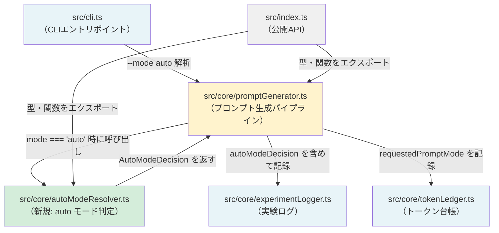
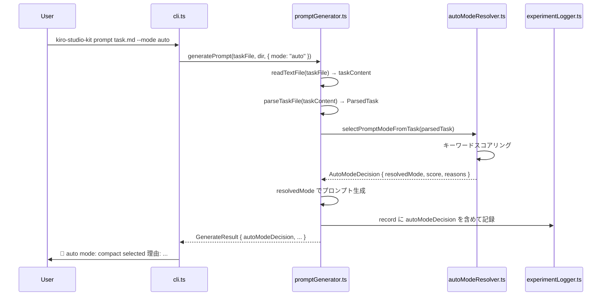

# 設計ドキュメント: auto-prompt-mode（半自動プロンプトモード選択）

## Overview

kiro-studio-kit の `prompt` コマンドに `--mode auto` オプションを追加し、task.md の内容をルールベースのキーワードスコアリングで分析して、最適なプロンプト生成モード（full / compact / minimal）を決定論的に選択する機能を実装する。

### 変更の目的

- **タスク規模に応じた自動モード選択**: task.md のキーワードを分析し、設計変更・スキーマ変更などの重要タスクには `full`、通常作業には `compact`、typo修正などの小修正には `minimal` を自動選択する
- **安全側に倒す設計**: Safety_Keyword（schema, auth, migration, breaking）やリファクタ系キーワードが含まれる場合はスコアに関係なく `full` を強制する
- **判定の透明性**: 判定理由（reasons）を CLI に表示し、実験ログにも記録することで、判定の妥当性を後から検証可能にする

### 設計方針

1. **既存型の非破壊**: `PromptMode` 型は変更せず、`RequestedPromptMode = PromptMode | "auto"` を新規追加する
2. **単一責任**: スコアリングロジックを `src/core/autoModeResolver.ts` に分離し、promptGenerator.ts の複雑化を防ぐ
3. **決定論的判定**: AI やヒューリスティクスではなく、キーワードマッチングによる再現可能なスコアリングで判定する
4. **後方互換性**: 既存の `full` / `compact` / `minimal` モードの動作は一切変更しない

---

## Architecture

### モジュール構成と依存関係



### 変更対象モジュール一覧

| モジュール | 変更種別 | 変更内容 |
|---|---|---|
| `src/core/autoModeResolver.ts` | **新規作成** | `selectPromptModeFromTask` 関数、キーワード定義、スコアリングロジック |
| `src/core/promptGenerator.ts` | 変更 | `RequestedPromptMode` 型追加、`GenerateOptions.mode` の型変更、`GenerateResult` に `autoModeDecision` 追加、パイプラインに auto 解決ステップ追加 |
| `src/core/experimentLogger.ts` | 変更 | `ExperimentRecord` に `requestedPromptMode`・`autoModeDecision` フィールド追加 |
| `src/core/tokenLedger.ts` | 変更 | `TokenLedgerRecord` に `requestedPromptMode` フィールド追加 |
| `src/cli.ts` | 変更 | `VALID_MODES` に `"auto"` 追加、auto 判定結果の表示、ヘルプテキスト更新 |
| `src/index.ts` | 変更 | `RequestedPromptMode`・`AutoModeDecision`・`selectPromptModeFromTask` をエクスポート |

### 処理フロー



---

## Components and Interfaces

### 新規型定義

#### `RequestedPromptMode` 型（`src/core/promptGenerator.ts`）

```typescript
/** ユーザーが CLI で指定するモード（既存 PromptMode + "auto"） */
export type RequestedPromptMode = PromptMode | "auto";
```

既存の `PromptMode = "full" | "compact" | "minimal"` は変更しない。

#### `AutoModeDecision` インターフェース（`src/core/autoModeResolver.ts`）

```typescript
import type { PromptMode } from "./promptGenerator.js";

/** auto モード判定の結果 */
export interface AutoModeDecision {
  requestedMode: "auto";
  resolvedMode: PromptMode;
  score: number;
  reasons: string[];
}
```

### 新規関数

#### `selectPromptModeFromTask`（`src/core/autoModeResolver.ts`）

```typescript
import type { ParsedTask } from "./promptGenerator.js";

/**
 * task.md の内容からキーワードスコアリングでプロンプトモードを決定する。
 *
 * スコアリングルール:
 * - Full_Keyword にマッチ → score +1（各キーワードごと）
 * - Minimal_Keyword にマッチ → score -1（各キーワードごと）
 * - Safety_Keyword にマッチ → score に関係なく full を強制
 * - "refactor" / "リファクタ" にマッチ → score に関係なく full を強制
 *
 * 閾値:
 * - score >= 4 → "full"
 * - 1 <= score < 4 → "compact"
 * - score <= 0 → "minimal"
 *
 * キーワードマッチング:
 * - 英語キーワード: \b（単語境界）で囲んでマッチ（大文字小文字無視）
 * - 日本語キーワード: 部分文字列マッチ
 *
 * reasons は絶対に空にならない:
 * - キーワードヒット時: マッチしたキーワードの説明を追加
 * - キーワードヒットなし時: "no keyword matched → default compact" を追加
 */
export function selectPromptModeFromTask(task: ParsedTask): AutoModeDecision;
```

### 既存インターフェースの変更

#### `GenerateOptions`（`src/core/promptGenerator.ts`）

```typescript
// 変更前
export interface GenerateOptions {
  mode?: PromptMode;
  compact?: boolean;
}

// 変更後
export interface GenerateOptions {
  mode?: RequestedPromptMode;  // PromptMode → RequestedPromptMode に拡張
  compact?: boolean;
}
```

#### `GenerateResult`（`src/core/promptGenerator.ts`）

```typescript
// 変更後（autoModeDecision フィールド追加）
export interface GenerateResult {
  promptPath: string;
  publicLogPath: string;
  experimentLogPath?: string;
  tokenLedgerPath?: string;
  tokenReduction?: TokenReduction;
  autoModeDecision?: AutoModeDecision;  // 新規追加: auto モード時のみ
}
```

#### `resolvePromptMode`（`src/core/promptGenerator.ts`）

```typescript
// 変更後: "auto" を受け取った場合は "full" にフォールバック（実際の auto 解決は generatePrompt 内で行う）
export function resolvePromptMode(options: GenerateOptions): PromptMode {
  if (options.mode && options.mode !== "auto") return options.mode;
  if (options.compact) return "compact";
  return "full";
}
```

#### `ExperimentRecord`（`src/core/experimentLogger.ts`）

```typescript
// 追加フィールド
export interface ExperimentRecord {
  // ... 既存フィールド
  requestedPromptMode?: RequestedPromptMode;  // 新規: "auto" | "full" | "compact" | "minimal"
  autoModeDecision?: {                        // 新規: auto モード時のみ
    score: number;
    reasons: string[];
  };
}
```

#### `TokenLedgerRecord`（`src/core/tokenLedger.ts`）

```typescript
// 追加フィールド
export interface TokenLedgerRecord {
  // ... 既存フィールド
  requestedPromptMode?: RequestedPromptMode;  // 新規: "auto" 時のみ記録
}
```

### CLI の変更

#### `VALID_MODES` の拡張

```typescript
// 変更前
const VALID_MODES: PromptMode[] = ["full", "compact", "minimal"];

// 変更後
const VALID_MODES: RequestedPromptMode[] = ["full", "compact", "minimal", "auto"];
```

#### auto 判定結果の表示

```typescript
// handlePrompt 内で GenerateResult.autoModeDecision が存在する場合に表示
if (result.autoModeDecision) {
  const { resolvedMode, reasons } = result.autoModeDecision;
  console.log(`🤖 auto mode: ${resolvedMode} selected 理由: ${reasons.join(", ")}`);
}
```

---

## Data Models

### キーワード定義

#### Full_Keyword（スコア +1）

| キーワード | 言語 | マッチ方式 |
|---|---|---|
| `設計` | 日本語 | 部分文字列 |
| `architecture` | 英語 | `\b` 単語境界 |
| `リファクタ` | 日本語 | 部分文字列（※ Safety扱い: full 強制） |
| `refactor` | 英語 | `\b` 単語境界（※ Safety扱い: full 強制） |
| `新機能` | 日本語 | 部分文字列 |
| `feature` | 英語 | `\b` 単語境界 |
| `API` | 英語 | `\b` 単語境界 |
| `DB` | 英語 | `\b` 単語境界 |
| `schema` | 英語 | `\b` 単語境界（※ Safety_Keyword） |
| `認証` | 日本語 | 部分文字列 |
| `auth` | 英語 | `\b` 単語境界（※ Safety_Keyword） |
| `migration` | 英語 | `\b` 単語境界（※ Safety_Keyword） |
| `破壊的変更` | 日本語 | 部分文字列 |
| `breaking` | 英語 | `\b` 単語境界（※ Safety_Keyword） |
| `複数ファイル` | 日本語 | 部分文字列 |
| `テスト追加` | 日本語 | 部分文字列 |
| `品質ゲート` | 日本語 | 部分文字列 |
| `property` | 英語 | `\b` 単語境界 |
| `fast-check` | 英語 | `\b` 単語境界 |

#### Minimal_Keyword（スコア -1）

| キーワード | 言語 | マッチ方式 |
|---|---|---|
| `typo` | 英語 | `\b` 単語境界 |
| `誤字` | 日本語 | 部分文字列 |
| `文言修正` | 日本語 | 部分文字列 |
| `README` | 英語 | `\b` 単語境界 |
| `コメント修正` | 日本語 | 部分文字列 |
| `小修正` | 日本語 | 部分文字列 |
| `1ファイル` | 日本語 | 部分文字列 |
| `継続` | 日本語 | 部分文字列 |
| `微修正` | 日本語 | 部分文字列 |

#### Safety_Keyword（full 強制）

| キーワード | 言語 | マッチ方式 |
|---|---|---|
| `schema` | 英語 | `\b` 単語境界 |
| `auth` | 英語 | `\b` 単語境界 |
| `migration` | 英語 | `\b` 単語境界 |
| `breaking` | 英語 | `\b` 単語境界 |
| `refactor` | 英語 | `\b` 単語境界 |
| `リファクタ` | 日本語 | 部分文字列 |

### スコアリングアルゴリズム

```
入力: ParsedTask { goal, scope, nonGoals }
合成テキスト = goal + "\n" + scope + "\n" + nonGoals（小文字化して検索）

1. score = 0, reasons = [], forceFull = false
2. Full_Keyword 各キーワードについて:
   - マッチした場合: score += 1, reasons に追加
3. Minimal_Keyword 各キーワードについて:
   - マッチした場合: score -= 1, reasons に追加
4. Safety_Keyword チェック:
   - いずれかにマッチした場合: forceFull = true
5. モード決定:
   - forceFull === true → "full"
   - score >= 4 → "full"
   - 1 <= score < 4 → "compact"
   - score <= 0 → "minimal"
6. reasons が空の場合:
   - reasons に "no keyword matched → default compact" を追加
   - resolvedMode = "compact"
7. 返却: { requestedMode: "auto", resolvedMode, score, reasons }
```

### ログレコードの拡張

#### ExperimentRecord（auto モード時）

```json
{
  "runId": "...",
  "timestamp": "...",
  "taskFile": "./task.md",
  "mode": "studio",
  "promptMode": "compact",
  "requestedPromptMode": "auto",
  "autoModeDecision": {
    "score": 2,
    "reasons": ["Full_Keyword: 設計 (+1)", "Full_Keyword: API (+1)"]
  },
  "promptPath": "...",
  "estimatedTokens": 1800,
  ...
}
```

#### TokenLedgerRecord（auto モード時）

```json
{
  "runId": "...",
  "timestamp": "...",
  "taskFile": "./task.md",
  "mode": "economy",
  "promptMode": "compact",
  "requestedPromptMode": "auto",
  ...
}
```


---

## Correctness Properties

*プロパティとは、システムの全ての有効な実行において成立すべき特性や振る舞いのことである。プロパティは人間が読める仕様と機械が検証可能な正確性保証の橋渡しをする。*

### Property 1: resolvedMode は常に有効な PromptMode である

*For any* 任意の `ParsedTask`（goal, scope, nonGoals が任意の文字列）に対して、`selectPromptModeFromTask(task).resolvedMode` は常に `"full"`, `"compact"`, `"minimal"` のいずれかである。

**Validates: Requirements 9.7**

### Property 2: reasons 配列は絶対に空にならない

*For any* 任意の `ParsedTask` に対して、`selectPromptModeFromTask(task).reasons.length` は常に 1 以上である。キーワードがマッチした場合はそのキーワードの説明が含まれ、マッチしなかった場合は `"no keyword matched → default compact"` が含まれる。

**Validates: Requirements 3.12**

### Property 3: Safety_Keyword またはリファクタキーワードが含まれる場合は常に full

*For any* 任意の `ParsedTask` で、goal, scope, nonGoals のいずれかに Safety_Keyword（schema, auth, migration, breaking）または refactor / リファクタ が含まれる場合、`selectPromptModeFromTask(task).resolvedMode` は常に `"full"` である。スコアの値に関係なく、この規則が優先される。

**Validates: Requirements 3.7, 3.8, 9.9**

### Property 4: Safety/リファクタキーワードが無い場合、スコアと閾値の整合性

*For any* 任意の `ParsedTask` で、Safety_Keyword および refactor / リファクタ を含まない場合、`selectPromptModeFromTask(task)` の返却値は以下の閾値ルールに従う:
- `score >= 4` のとき `resolvedMode === "full"`
- `1 <= score < 4` のとき `resolvedMode === "compact"`
- `score <= 0` のとき `resolvedMode === "minimal"`

ただし、キーワードが一切マッチしない場合（score === 0 かつ reasons にデフォルトメッセージのみ）は `resolvedMode === "compact"` となる（安全デフォルト）。

**Validates: Requirements 3.4, 3.5, 3.6, 9.4, 9.8**

### Property 5: キーワードマッチングは大文字小文字を区別しない

*For any* 任意の Full_Keyword または Minimal_Keyword を任意の大文字小文字の組み合わせで goal に埋め込んだ `ParsedTask` に対して、`selectPromptModeFromTask(task).reasons` にそのキーワードに対応する説明が含まれる。

**Validates: Requirements 2.2, 3.10**

---

## Error Handling

### CLI エラー処理

| エラー条件 | 処理 | 終了コード |
|---|---|---|
| `--mode` に不正値が指定された | stderr にエラーメッセージ + 有効値一覧を表示 | 1 |
| `--mode` の値が省略された | stderr にエラーメッセージを表示 | 1 |
| `--compact` と `--mode auto` が同時に指定された | stderr に警告メッセージを表示（エラーではない）、`--mode auto` を優先 | 0（正常終了） |

### エラーメッセージ例

```
エラー: --mode に無効な値 "ultra" が指定されました。
有効な値: full, compact, minimal, auto
```

```
警告: --compact と --mode が同時に指定されました。--mode "auto" を優先します。
```

### autoModeResolver のエラー処理

- `selectPromptModeFromTask` は純粋関数であり、例外を投げない
- 入力の `ParsedTask` が空文字列のみの場合でも、デフォルトの `"compact"` を返す
- `reasons` 配列が空になることはない（キーワードヒットなし時はデフォルトメッセージを追加）

### promptGenerator のエラー処理

- `mode: "auto"` を受け取った場合、task ファイルの読み込みエラーは既存のエラーハンドリング（`readTextFile` の ENOENT / EACCES 変換）で処理される
- `selectPromptModeFromTask` が返す `resolvedMode` は常に有効な `PromptMode` であるため、後続の処理でエラーは発生しない

---

## Testing Strategy

### テスト方針

**デュアルテストアプローチ**:
- **ユニットテスト（例ベース）**: 具体的なキーワードマッチング、CLI フラグ解析、ログ記録、後方互換性の確認
- **プロパティベーステスト（fast-check）**: 普遍的な性質の検証（resolvedMode の有効性、reasons の非空性、Safety キーワードの強制、スコア閾値の整合性、大文字小文字の無視）

### プロパティテストの設定

- プロパティテストライブラリ: `fast-check`（既存プロジェクトで使用中）
- 各プロパティテストは最低 100 イテレーション実行する（`{ numRuns: 100 }`）
- タグ形式: `Feature: auto-prompt-mode, Property {番号}: {プロパティ説明}`
- 各正確性プロパティに対して1つのプロパティベーステストを実装する

### 追加・更新するテストファイル

#### `src/__tests__/autoModeResolver.test.ts`（新規作成）

**例ベーステスト:**
- `selectPromptModeFromTask` が Safety_Keyword を含むタスクで `"full"` を返す
- `selectPromptModeFromTask` が Minimal_Keyword のみのタスクで `"minimal"` を返す
- `selectPromptModeFromTask` がキーワードなしのタスクで `"compact"` を返す（デフォルト）
- `selectPromptModeFromTask` が "refactor" を含むタスクで `"full"` を返す
- `selectPromptModeFromTask` が "リファクタ" を含むタスクで `"full"` を返す
- 英語キーワードの単語境界マッチング（"capability" が "api" にマッチしないこと）
- 日本語キーワードの部分文字列マッチング（"設計変更" が "設計" にマッチすること）
- キーワードなし時に reasons に "no keyword matched → default compact" が含まれること

#### `src/__tests__/autoModeResolver.property.test.ts`（新規作成）

**プロパティベーステスト:**

```typescript
// Property 1: resolvedMode は常に有効な PromptMode
it("Feature: auto-prompt-mode, Property 1: resolvedMode は常に有効な PromptMode", () => {
  fc.assert(fc.property(
    fc.record({ goal: fc.string(), scope: fc.string(), nonGoals: fc.string() }),
    (task) => {
      const decision = selectPromptModeFromTask(task);
      expect(["full", "compact", "minimal"]).toContain(decision.resolvedMode);
    }
  ), { numRuns: 100 });
});

// Property 2: reasons は絶対に空にならない
it("Feature: auto-prompt-mode, Property 2: reasons は絶対に空にならない", () => {
  fc.assert(fc.property(
    fc.record({ goal: fc.string(), scope: fc.string(), nonGoals: fc.string() }),
    (task) => {
      const decision = selectPromptModeFromTask(task);
      expect(decision.reasons.length).toBeGreaterThanOrEqual(1);
    }
  ), { numRuns: 100 });
});

// Property 3: Safety/リファクタキーワードが含まれる場合は常に full
it("Feature: auto-prompt-mode, Property 3: Safety/リファクタキーワード → full", () => {
  const safetyKeywords = ["schema", "auth", "migration", "breaking", "refactor", "リファクタ"];
  fc.assert(fc.property(
    fc.record({ goal: fc.string(), scope: fc.string(), nonGoals: fc.string() }),
    fc.constantFrom(...safetyKeywords),
    (task, keyword) => {
      const taskWithSafety = { ...task, goal: task.goal + " " + keyword + " " };
      const decision = selectPromptModeFromTask(taskWithSafety);
      expect(decision.resolvedMode).toBe("full");
    }
  ), { numRuns: 100 });
});

// Property 4: Safety/リファクタなし時のスコア閾値整合性
it("Feature: auto-prompt-mode, Property 4: スコア閾値整合性", () => {
  fc.assert(fc.property(
    fc.record({ goal: fc.string(), scope: fc.string(), nonGoals: fc.string() }),
    (task) => {
      const decision = selectPromptModeFromTask(task);
      const hasSafety = /* Safety/refactor keyword check */;
      if (!hasSafety) {
        if (decision.score >= 4) expect(decision.resolvedMode).toBe("full");
        else if (decision.score >= 1) expect(decision.resolvedMode).toBe("compact");
        else if (decision.reasons.length === 1 && decision.reasons[0].includes("no keyword matched"))
          expect(decision.resolvedMode).toBe("compact");
        else expect(decision.resolvedMode).toBe("minimal");
      }
    }
  ), { numRuns: 100 });
});

// Property 5: 大文字小文字を区別しないマッチング
it("Feature: auto-prompt-mode, Property 5: 大文字小文字無視", () => {
  const englishKeywords = ["architecture", "feature", "API", "DB", "property"];
  fc.assert(fc.property(
    fc.constantFrom(...englishKeywords),
    fc.func(fc.boolean()),
    (keyword, toUpperFn) => {
      const caseVaried = keyword.split("").map((c, i) => toUpperFn(i) ? c.toUpperCase() : c.toLowerCase()).join("");
      const task = { goal: "task with " + caseVaried + " keyword", scope: "", nonGoals: "" };
      const decision = selectPromptModeFromTask(task);
      expect(decision.reasons.some(r => r.toLowerCase().includes(keyword.toLowerCase()))).toBe(true);
    }
  ), { numRuns: 100 });
});
```

#### `src/__tests__/cli.test.ts`（更新）

- `parseMode(["--mode", "auto"])` が `{ mode: "auto", invalid: null }` を返すこと
- `--compact` と `--mode auto` の同時指定で警告が出力されること

#### `src/__tests__/promptGenerator.test.ts`（更新）

- `resolvePromptMode({ mode: "auto" })` が `"full"` を返すこと（auto は generatePrompt 内で解決するため、resolvePromptMode では "auto" をスキップして "full" にフォールバック）
- `generatePrompt` に `mode: "auto"` を渡した場合に `GenerateResult.autoModeDecision` が存在すること
- 既存モード（full, compact, minimal）の動作が変わらないこと

#### `src/__tests__/integration.test.ts`（更新）

- `--mode auto` でのエンドツーエンドテスト
- auto モード時の実験ログに `requestedPromptMode` と `autoModeDecision` が記録されること
- auto モード時のトークン台帳に `requestedPromptMode` が記録されること
