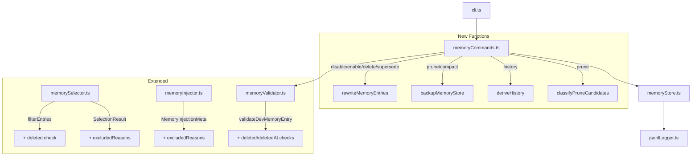

# Design Document: Development Memory Lifecycle Management

## Overview

This design extends the existing Development Memory system (Phase 1-2) with lifecycle management operations: disable/enable, soft-delete, supersede, prune, compact, and history. The implementation follows the existing patterns in `memoryCommands.ts` and `memoryStore.ts`, adding a rewrite-based mutation strategy for state changes and extending the filter pipeline with detailed exclusion reporting.

### Design Principles

- **Backward compatibility**: All new fields are optional. Existing entries without `deleted`/`deletedAt` continue to work unchanged.
- **Rewrite approach**: Lifecycle mutations read all entries, modify the target, and write back the complete set. The store is small (<1000 entries typically), making this safe and simple.
- **Soft delete over hard delete**: Entries are marked `deleted=true` rather than removed, enabling recovery until explicit prune/compact.
- **Backup before destruction**: `prune --apply` and `compact` create timestamped backups before modifying the store.
- **Pure functions where possible**: Prune candidate classification, history derivation, and exclusion categorization are pure functions testable with property-based testing.

## Architecture



## Components and Interfaces

### Extended Types (`memoryValidator.ts`)

```typescript
/** Extended DevMemoryEntry with lifecycle fields */
export interface DevMemoryEntry {
  // ... existing fields unchanged ...
  
  // New optional lifecycle fields
  deleted?: boolean;
  deletedAt?: string; // ISO 8601 timestamp
}
```

### New Store Functions (`memoryStore.ts`)

```typescript
/**
 * Rewrite the entire memory store with the provided entries.
 * Used for state-change operations (disable, enable, delete, supersede).
 * Validates all entries before writing.
 */
export async function rewriteMemoryEntries(
  entries: DevMemoryEntry[],
  storePath?: string,
): Promise<string>;

/**
 * Create a timestamped backup of the memory store.
 * Returns the backup file path.
 * Format: .kiro/ksk/dev-memory.backup-YYYYMMDD.jsonl
 */
export async function backupMemoryStore(
  storePath?: string,
): Promise<string>;
```

### Exclusion Reasons (`memorySelector.ts`)

```typescript
/** Breakdown of why entries were excluded from selection */
export interface ExcludedReasons {
  disabled: number;
  deleted: number;
  expired: number;
  superseded: number;
  lowConfidence: number;
}

/** Extended SelectionResult */
export interface SelectionResult {
  selected: DevMemoryEntry[];
  totalAvailable: number;
  selectedDetails?: ScoredMemoryEntry[];
  consideredCount?: number;
  excludedCount?: number;
  totalSelectedChars?: number;
  excludedReasons?: ExcludedReasons; // NEW
}
```

### Extended MemoryInjectionMeta (`memoryInjector.ts`)

```typescript
export interface MemoryInjectionMeta {
  // ... existing fields ...
  excludedReasons?: ExcludedReasons; // NEW
}
```

### New Command Handlers (`memoryCommands.ts`)

```typescript
/** Disable a memory entry by ID */
export async function handleMemoryDisable(args: string[]): Promise<void>;

/** Enable a memory entry by ID */
export async function handleMemoryEnable(args: string[]): Promise<void>;

/** Soft-delete a memory entry by ID */
export async function handleMemoryDelete(args: string[]): Promise<void>;

/** Mark oldId as superseded by newId */
export async function handleMemorySupersede(args: string[]): Promise<void>;

/** Prune obsolete entries (dry-run by default, --apply to execute) */
export async function handleMemoryPrune(args: string[]): Promise<void>;

/** Compact the store by removing deleted entries */
export async function handleMemoryCompact(args: string[]): Promise<void>;

/** Display lifecycle history for an entry */
export async function handleMemoryHistory(args: string[]): Promise<void>;
```

### Prune Candidate Classification (pure function)

```typescript
/** Classification result for a single entry */
export interface PruneClassification {
  entry: DevMemoryEntry;
  reason: "deleted" | "disabled" | "expired" | "superseded" | "stale";
}

/**
 * Classify entries as prune candidates. Pure function.
 * An entry is a prune candidate if ANY of:
 * - deleted === true
 * - enabled === false
 * - expiresAt is in the past
 * - superseded by another entry in the set
 * - older than 180 days AND severity === "low" AND confidence === "low"
 */
export function classifyPruneCandidates(
  entries: DevMemoryEntry[],
  now?: Date,
): PruneClassification[];
```

### History Derivation (pure function)

```typescript
/** A single lifecycle event */
export interface LifecycleEvent {
  timestamp: string; // ISO 8601
  event: "created" | "disabled" | "deleted" | "superseded";
  detail?: string;
}

/**
 * Derive lifecycle events from an entry's current state and the full entry set.
 * Events are returned in chronological order.
 * Pure function — no side effects.
 */
export function deriveHistory(
  entry: DevMemoryEntry,
  allEntries: DevMemoryEntry[],
): LifecycleEvent[];
```

## Data Models

### DevMemoryEntry (Extended)

| Field | Type | Required | Description |
|-------|------|----------|-------------|
| id | string | yes | UUID |
| createdAt | string | yes | ISO 8601 creation timestamp |
| kind | DevMemoryKind | yes | Entry category |
| summary | string | yes | Short description |
| trigger | string | yes | What caused the issue |
| fix | string | yes | How it was resolved |
| futurePromptHint | string | yes | Hint for future prompts |
| relatedFiles | string[] | yes | Related file paths |
| relatedSymbols | string[] | yes | Related code symbols |
| tags | string[] | yes | Searchable tags |
| severity | Severity | yes | low/medium/high |
| confidence | Confidence | yes | low/medium/high |
| enabled | boolean | yes | Whether entry is active |
| project | string | no | Project name |
| phase | string | no | Development phase |
| taskName | string | no | Task name |
| supersedes | string[] | no | IDs this entry supersedes |
| expiresAt | string | no | ISO 8601 expiry timestamp |
| **deleted** | **boolean** | **no** | **Whether entry is soft-deleted** |
| **deletedAt** | **string** | **no** | **ISO 8601 deletion timestamp** |

### ExcludedReasons

| Field | Type | Description |
|-------|------|-------------|
| disabled | number | Count of entries excluded because enabled=false |
| deleted | number | Count of entries excluded because deleted=true |
| expired | number | Count of entries excluded because expiresAt is past |
| superseded | number | Count of entries excluded because another entry supersedes them |
| lowConfidence | number | Count of entries excluded because confidence="low" |

### Backup File

- Path: `.kiro/ksk/dev-memory.backup-YYYYMMDD.jsonl`
- Content: Exact byte-for-byte copy of the memory store at backup time
- One backup per day (overwrites if same date)

## Algorithms

### Rewrite Operation

```
1. Read all entries from store (readMemoryEntries)
2. Find target entry by ID
3. If not found → error exit
4. Modify target entry fields
5. Write all entries back (rewriteMemoryEntries)
```

### Prune Candidate Algorithm

```
For each entry in store:
  if entry.deleted === true → candidate (reason: "deleted")
  else if entry.enabled === false → candidate (reason: "disabled")
  else if entry.expiresAt && new Date(entry.expiresAt) < now → candidate (reason: "expired")
  else if any other entry's supersedes array contains entry.id → candidate (reason: "superseded")
  else if age > 180 days AND severity === "low" AND confidence === "low" → candidate (reason: "stale")
  else → not a candidate
```

Priority order matters: first matching condition wins (no double-counting).

### Compact Algorithm

```
1. Create backup (backupMemoryStore)
2. Read all entries
3. Filter to entries where deleted !== true
4. Validate each remaining entry
5. Rewrite store with filtered entries
6. Report before/after counts
```

### History Derivation Algorithm

```
For entry with ID:
  events = []
  events.push({ timestamp: entry.createdAt, event: "created" })
  
  if entry.enabled === false:
    events.push({ timestamp: entry.createdAt, event: "disabled", detail: "currently disabled" })
  
  if entry.deleted === true:
    events.push({ timestamp: entry.deletedAt ?? entry.createdAt, event: "deleted" })
  
  for other in allEntries:
    if other.supersedes?.includes(entry.id):
      events.push({ timestamp: other.createdAt, event: "superseded", detail: `by ${other.id}` })
  
  sort events by timestamp ascending
  return events
```

### Filter Pipeline Extension

```
For each entry:
  Evaluation order (first match wins for exclusion category):
  1. if deleted === true → exclude (reason: "deleted")
  2. if enabled === false → exclude (reason: "disabled")  
  3. if confidence === "low" → exclude (reason: "lowConfidence")
  4. if expired → exclude (reason: "expired")
  5. if superseded → exclude (reason: "superseded")
  else → include in filtered set
```

## Correctness Properties

*A property is a characteristic or behavior that should hold true across all valid executions of a system — essentially, a formal statement about what the system should do. Properties serve as the bridge between human-readable specifications and machine-verifiable correctness guarantees.*

### Property 1: Rewrite operation isolation

*For any* memory store and any single-entry mutation (disable, enable, delete, supersede), all entries other than the target entry SHALL remain unchanged after the rewrite operation.

**Validates: Requirements 1.1, 1.2, 2.1, 3.1**

### Property 2: Deleted entries excluded from selection

*For any* set of memory entries and any task text and any memory mode (auto or full), entries with `deleted` set to `true` SHALL never appear in the selection results.

**Validates: Requirements 2.3, 7.1**

### Property 3: Superseded entries excluded from selection

*For any* set of memory entries where entry A's `supersedes` array contains entry B's ID, and any task text and any memory mode (auto or full), entry B SHALL never appear in the selection results.

**Validates: Requirements 3.3**

### Property 4: Prune dry-run does not mutate store

*For any* memory store state, executing the prune candidate classification (dry-run logic) SHALL produce a result without modifying the input entries array — the entries before and after classification are deeply equal.

**Validates: Requirements 4.1, 4.5**

### Property 5: Compact preserves all active entry data

*For any* memory store containing a mix of deleted and non-deleted entries, after compact operation, every non-deleted entry from the original store SHALL be present in the compacted store with all fields unchanged (deep equality).

**Validates: Requirements 5.2, 5.5**

### Property 6: Compact produces equivalent selection results

*For any* memory store, any task text, and any memory mode, selecting memories from the original store and selecting memories from the compacted store SHALL produce equivalent `selected` arrays (same entries in same order).

**Validates: Requirements 5.6**

### Property 7: History events are in chronological order

*For any* memory entry and any set of entries (including entries that may supersede it), the derived lifecycle events SHALL be sorted in non-decreasing timestamp order.

**Validates: Requirements 6.1**

### Property 8: Exclusion category partition

*For any* set of memory entries, the sum of all `excludedReasons` category counts SHALL equal the total number of excluded entries, and each excluded entry SHALL be counted in exactly one category.

**Validates: Requirements 7.2, 7.4**

### Property 9: Validator accepts valid optional lifecycle fields

*For any* valid DevMemoryEntry, adding `deleted` as a boolean value and/or `deletedAt` as a string value SHALL not cause validation to fail. Conversely, *for any* valid DevMemoryEntry with `deleted` set to a non-boolean value or `deletedAt` set to a non-string value, validation SHALL fail with a descriptive error.

**Validates: Requirements 9.1, 9.2, 9.3, 9.4, 9.5**

### Property 10: Backup is an exact copy of store contents

*For any* memory store state, the backup file created by `backupMemoryStore` SHALL contain byte-for-byte identical content to the original store file at the time of backup.

**Validates: Requirements 10.2**

## Error Handling

| Operation | Error Condition | Behavior |
|-----------|----------------|----------|
| disable/enable/delete | ID not found | stderr error message, exit code 1 |
| disable/enable | Already in target state | stderr warning, exit code 0 |
| supersede | Either ID not found | stderr error identifying missing ID, exit code 1 |
| prune --apply | Backup write failure | stderr error, abort without modifying store |
| compact | Backup write failure | stderr error, abort without modifying store |
| compact | Validation failure on entry | stderr warning, skip invalid entry |
| history | ID not found | stderr error message, exit code 1 |
| rewriteMemoryEntries | Validation failure | Throw Error with details |

All destructive operations (prune --apply, compact) follow the pattern:
1. Attempt backup creation
2. If backup fails → abort with error, store unchanged
3. If backup succeeds → proceed with modification

## Testing Strategy

### Property-Based Tests (fast-check, minimum 100 iterations each)

The following property tests map directly to the Correctness Properties above:

| Test File | Property | Tag |
|-----------|----------|-----|
| `memoryLifecycle.property.test.ts` | Property 1: Rewrite isolation | Feature: dev-memory-lifecycle, Property 1: Rewrite operation isolation |
| `memoryLifecycle.property.test.ts` | Property 2: Deleted exclusion | Feature: dev-memory-lifecycle, Property 2: Deleted entries excluded from selection |
| `memoryLifecycle.property.test.ts` | Property 3: Superseded exclusion | Feature: dev-memory-lifecycle, Property 3: Superseded entries excluded from selection |
| `memoryLifecycle.property.test.ts` | Property 4: Prune dry-run immutability | Feature: dev-memory-lifecycle, Property 4: Prune dry-run does not mutate store |
| `memoryLifecycle.property.test.ts` | Property 5: Compact preserves active | Feature: dev-memory-lifecycle, Property 5: Compact preserves all active entry data |
| `memoryLifecycle.property.test.ts` | Property 6: Compact selection equivalence | Feature: dev-memory-lifecycle, Property 6: Compact produces equivalent selection results |
| `memoryLifecycle.property.test.ts` | Property 7: History chronological order | Feature: dev-memory-lifecycle, Property 7: History events are in chronological order |
| `memoryLifecycle.property.test.ts` | Property 8: Exclusion partition | Feature: dev-memory-lifecycle, Property 8: Exclusion category partition |
| `memoryLifecycle.property.test.ts` | Property 9: Validator lifecycle fields | Feature: dev-memory-lifecycle, Property 9: Validator accepts valid optional lifecycle fields |
| `memoryLifecycle.property.test.ts` | Property 10: Backup exact copy | Feature: dev-memory-lifecycle, Property 10: Backup is an exact copy of store contents |

**Configuration:**
- Library: `fast-check` (already in devDependencies)
- Minimum iterations: 100 per property (`{ numRuns: 100 }`)
- Each test tagged with comment referencing design property

### Unit Tests (vitest)

| Test File | Coverage |
|-----------|----------|
| `memoryLifecycle.test.ts` | CLI handlers: disable, enable, delete, supersede, prune, compact, history |
| `memoryLifecycle.test.ts` | Error cases: missing IDs, already-in-state warnings |
| `memoryLifecycle.test.ts` | Stats extension: deleted count, superseded count, average age, file size |
| `memoryLifecycle.test.ts` | Backup file naming and overwrite behavior |

### Integration Tests

- End-to-end CLI invocation for each new subcommand
- Verify file system side effects (backup creation, store rewrite)
- Verify exit codes for error conditions

### Test Generators (fast-check arbitraries)

```typescript
/** Generate a valid DevMemoryEntry with optional lifecycle fields */
const arbDevMemoryEntry: fc.Arbitrary<DevMemoryEntry>;

/** Generate a store (array of entries) with controlled deleted/superseded ratios */
const arbMemoryStore: fc.Arbitrary<DevMemoryEntry[]>;

/** Generate a random task text for selection testing */
const arbTaskText: fc.Arbitrary<string>;
```

Reuse existing generators from `memoryStore.property.test.ts` and `memorySelector.property.test.ts`, extending them with the new optional fields.
