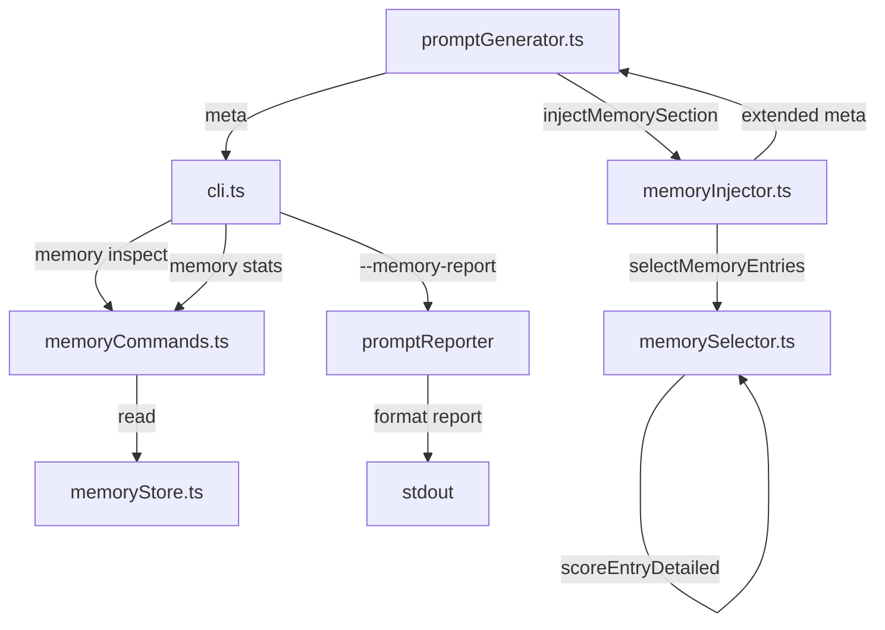

# Design Document: Dev Memory Visibility

## Overview

This feature adds observability to the Development Memory system (Phase 1). It introduces detailed scoring with match reasons, extended selection metadata, CLI reporting, and inspection commands. The design preserves full backward compatibility with existing interfaces while layering new fields and functions alongside them.

### Goals

- Expose *why* each memory entry was selected (match reasons with point breakdown)
- Provide aggregate statistics about the memory store
- Enable CLI-based inspection of individual entries and selection behavior
- Maintain zero runtime dependencies and pure-function architecture in the selector

### Non-Goals

- Changing the scoring algorithm itself (points remain identical)
- Adding persistent caching or indexing of scores
- Modifying the memory store format

---

## Architecture



The architecture adds:
1. `scoreEntryDetailed` as a new export from `memorySelector.ts` (pure function)
2. Extended `SelectionResult` interface with optional detail fields
3. Extended `MemoryInjectionMeta` interface with optional detail fields
4. New CLI flag `--memory-report` on the `prompt` command
5. New subcommands `memory inspect` and `memory stats` in `memoryCommands.ts`

All additions are backward-compatible: existing consumers see the same fields they always did.

---

## Components and Interfaces

### memorySelector.ts — New Types

```typescript
/** A single match reason explaining why points were awarded */
export interface MemoryMatchReason {
  type: "file" | "symbol" | "tag" | "kind" | "severity" | "recent";
  value: string;
  points: number;
}

/** Detailed scoring result for a single entry */
export interface ScoredMemoryEntry {
  entry: DevMemoryEntry;
  score: number;
  reasons: MemoryMatchReason[];
  estimatedChars: number;
}
```

### memorySelector.ts — New Function: `scoreEntryDetailed`

```typescript
/**
 * Score a single entry against task text, returning detailed match reasons.
 * Produces the SAME numeric score as scoreEntry for identical inputs.
 * Pure function — no side effects.
 */
export function scoreEntryDetailed(
  entry: DevMemoryEntry,
  taskText: string,
): ScoredMemoryEntry;
```

**Algorithm** (mirrors `scoreEntry` exactly):

```
lowerTask = taskText.toLowerCase()
reasons = []

for each file in entry.relatedFiles:
  if lowerTask.includes(file.toLowerCase()):
    reasons.push({ type: "file", value: file, points: 5 })

for each symbol in entry.relatedSymbols:
  if lowerTask.includes(symbol.toLowerCase()):
    reasons.push({ type: "symbol", value: symbol, points: 4 })

for each tag in entry.tags:
  if lowerTask.includes(tag.toLowerCase()):
    reasons.push({ type: "tag", value: tag, points: 3 })

keywords = KIND_KEYWORDS[entry.kind]
if keywords.some(kw => lowerTask.includes(kw)):
  reasons.push({ type: "kind", value: entry.kind, points: 2 })

if entry.severity === "high":
  reasons.push({ type: "severity", value: "high", points: 2 })
else if entry.severity === "medium":
  reasons.push({ type: "severity", value: "medium", points: 1 })

if (Date.now() - new Date(entry.createdAt).getTime()) <= 30_DAYS_MS:
  reasons.push({ type: "recent", value: "within_30d", points: 1 })

score = reasons.reduce((sum, r) => sum + r.points, 0)
estimatedChars = estimateEntryChars(entry)

return { entry, score, reasons, estimatedChars }
```

**Design Decision**: `scoreEntryDetailed` is implemented as a new function rather than modifying `scoreEntry` to avoid any risk of breaking existing callers. The existing `scoreEntry` remains unchanged. Both functions use the same logic; `scoreEntryDetailed` simply collects reasons along the way.

### memorySelector.ts — Extended SelectionResult

```typescript
/** Selection result (backward-compatible extension) */
export interface SelectionResult {
  // Existing fields (unchanged)
  selected: DevMemoryEntry[];
  totalAvailable: number;
  // New fields
  selectedDetails?: ScoredMemoryEntry[];
  consideredCount?: number;
  excludedCount?: number;
  totalSelectedChars?: number;
}
```

The new fields are typed as optional (`?`) so existing code that destructures `{ selected, totalAvailable }` continues to work without modification.

**`selectMemoryEntries` changes**: The function body is updated to also populate the new fields. The `selected` and `totalAvailable` values remain identical to Phase 1 behavior.

### memoryInjector.ts — Extended MemoryInjectionMeta

```typescript
/** Injection metadata for logging (backward-compatible extension) */
export interface MemoryInjectionMeta {
  // Existing fields (unchanged)
  mode: MemoryMode;
  selectedCount: number;
  selectedIds: string[];
  totalAvailable: number;
  // New fields
  consideredCount?: number;
  excludedCount?: number;
  totalSelectedChars?: number;
  topScore?: number;
  selectedDetails?: Array<{
    id: string;
    summary: string;
    kind: string;
    score: number;
    matchedReasons: MemoryMatchReason[];
    estimatedChars: number;
  }>;
}
```

**`injectMemorySection` changes**: After calling `selectMemoryEntries`, the function reads the new fields from `SelectionResult` and maps them into `MemoryInjectionMeta`. When mode is `"off"`, all new numeric fields are set to 0 and `selectedDetails` is an empty array.

### memoryCommands.ts — New Subcommands

```typescript
/** Handle `memory inspect <id>` subcommand */
export async function handleMemoryInspect(args: string[]): Promise<void>;

/** Handle `memory stats` subcommand */
export async function handleMemoryStats(): Promise<void>;
```

**`handleMemory` routing update**: Add cases for `"inspect"` and `"stats"` in the switch statement.

### cli.ts — New Flag and Report

```typescript
/** Parse --memory-report flag */
export function parseMemoryReportFlag(args: string[]): boolean;
```

**`handlePrompt` changes**: After prompt generation, if `--memory-report` is set, format and print the memory report to stdout using data from `MemoryInjectionMeta`.

**Report format** (printed to stdout after normal output):

```
📊 Memory Report
  Mode: auto | Selected: 3 / 12 available
  Injected chars: 847 | Top score: 9

  #1 [test_fix] Fix vitest mock isolation (score: 9)
     Reasons: file:memorySelector.ts(5) tag:vitest(3) recent:within_30d(1)
  #2 [gotcha] ESM import requires .js extension (score: 7)
     Reasons: symbol:import(4) tag:esm(3)
  ...
```

---

## Data Models

### MemoryMatchReason

| Field  | Type   | Description                                    |
|--------|--------|------------------------------------------------|
| type   | string | One of: "file", "symbol", "tag", "kind", "severity", "recent" |
| value  | string | The matched value (filename, symbol, tag, kind, severity level, or "within_30d") |
| points | number | Points awarded for this match                  |

### ScoredMemoryEntry

| Field         | Type               | Description                          |
|---------------|-------------------|--------------------------------------|
| entry         | DevMemoryEntry    | The original memory entry            |
| score         | number            | Total score (sum of reasons.points)  |
| reasons       | MemoryMatchReason[] | All match reasons                  |
| estimatedChars| number            | Estimated formatted character count  |

### Extended SelectionResult (new fields)

| Field             | Type               | Description                                    |
|-------------------|--------------------|------------------------------------------------|
| selectedDetails   | ScoredMemoryEntry[] | Detailed scoring for each selected entry      |
| consideredCount   | number             | Entries that passed filtering                  |
| excludedCount     | number             | Entries excluded by filtering                  |
| totalSelectedChars| number             | Sum of estimatedChars across selected entries  |

### Extended MemoryInjectionMeta (new fields)

| Field             | Type    | Description                                         |
|-------------------|---------|-----------------------------------------------------|
| consideredCount   | number  | Entries that passed filtering                       |
| excludedCount     | number  | Entries excluded by filtering                       |
| totalSelectedChars| number  | Total injected characters                           |
| topScore          | number  | Maximum score among selected entries (0 if none)    |
| selectedDetails   | array   | Per-entry detail objects (id, summary, kind, score, matchedReasons, estimatedChars) |

---

## Correctness Properties

*A property is a characteristic or behavior that should hold true across all valid executions of a system — essentially, a formal statement about what the system should do. Properties serve as the bridge between human-readable specifications and machine-verifiable correctness guarantees.*

### Property 1: Score Consistency

*For any* valid DevMemoryEntry and any taskText string, `scoreEntryDetailed(entry, taskText).score` SHALL equal `scoreEntry(entry, taskText)`.

**Validates: Requirements 1.2, 1.10, 8.1**

### Property 2: Reason Points Sum to Score

*For any* valid DevMemoryEntry and any taskText string, the sum of `reasons[i].points` across all reasons returned by `scoreEntryDetailed(entry, taskText)` SHALL equal the returned `score`.

**Validates: Requirements 1.3, 1.4, 1.5, 1.6, 1.7, 1.8, 1.9**

### Property 3: Selected Details Consistency

*For any* set of DevMemoryEntry records, taskText, and MemoryMode, the `selectedDetails` array returned by `selectMemoryEntries` SHALL contain entries that correspond 1:1 (same order) with the `selected` array, where `selectedDetails[i].entry === selected[i]`.

**Validates: Requirements 2.1, 2.6**

### Property 4: Total Selected Chars Sum Invariant

*For any* SelectionResult returned by `selectMemoryEntries`, `totalSelectedChars` SHALL equal the sum of `selectedDetails[i].estimatedChars` for all i.

**Validates: Requirements 2.4, 8.2**

### Property 5: Score Ordering

*For any* SelectionResult returned by `selectMemoryEntries` where `selectedDetails.length > 1`, for all consecutive pairs (i, i+1), `selectedDetails[i].score >= selectedDetails[i+1].score`.

**Validates: Requirements 2.5, 8.3**

### Property 6: Filtering Count Invariant

*For any* set of DevMemoryEntry records, taskText, and MemoryMode (not "off"), `consideredCount + excludedCount` SHALL equal the total number of input entries.

**Validates: Requirements 2.2, 2.3**

---

## Error Handling

| Scenario                          | Behavior                                                    |
|-----------------------------------|-------------------------------------------------------------|
| `memory inspect` with invalid ID  | Print error to stderr, exit with code 1                     |
| `memory stats` with empty store   | Display all counts as 0, no error                           |
| `memory stats` with corrupt lines | Skip invalid lines (existing behavior), compute stats on valid entries |
| `--memory-report` with mode "off" | Display report showing mode "off", all counts 0             |
| `scoreEntryDetailed` with invalid date in createdAt | Treat as non-recent (no "recent" reason added) |

---

## Testing Strategy

### Property-Based Tests (fast-check, minimum 100 iterations each)

The following properties will be implemented as property-based tests using `fast-check`:

1. **Score Consistency** — Feature: dev-memory-visibility, Property 1: Score Consistency
2. **Reason Points Sum** — Feature: dev-memory-visibility, Property 2: Reason Points Sum to Score
3. **Selected Details Consistency** — Feature: dev-memory-visibility, Property 3: Selected Details Consistency
4. **Total Chars Sum Invariant** — Feature: dev-memory-visibility, Property 4: Total Selected Chars Sum Invariant
5. **Score Ordering** — Feature: dev-memory-visibility, Property 5: Score Ordering
6. **Filtering Count Invariant** — Feature: dev-memory-visibility, Property 6: Filtering Count Invariant

**Generator strategy**: Reuse the existing `DevMemoryEntry` arbitrary from `memoryValidator.property.test.ts` / `memorySelector.property.test.ts`. Generate taskText as arbitrary strings that may or may not contain entry field values.

### Unit Tests (vitest)

- `scoreEntryDetailed` returns correct reason types for each match category
- `selectMemoryEntries` populates new fields correctly
- `injectMemorySection` extended meta fields are correct
- `injectMemorySection` with mode "off" returns zeroed new fields
- `handleMemoryInspect` displays all fields for valid ID
- `handleMemoryInspect` errors on missing ID
- `handleMemoryStats` displays correct counts and breakdowns
- `handleMemoryStats` handles empty store
- CLI `--memory-report` flag parsing
- CLI report output format
- CLI `--memory-report` does not alter prompt file content
- CLI flag combinations (`--memory-report` + `--mode` + `--out`)

### Integration Tests

- End-to-end: `prompt` command with `--memory-report` produces correct stdout
- End-to-end: `memory inspect` and `memory stats` with real JSONL store

### Test Configuration

- Property tests: `fc.assert(fc.property(...), { numRuns: 100 })`
- Test files: `src/__tests__/memoryVisibility.property.test.ts`, `src/__tests__/memoryVisibility.test.ts`
- Library: fast-check (already in devDependencies)
- Runner: vitest --run
