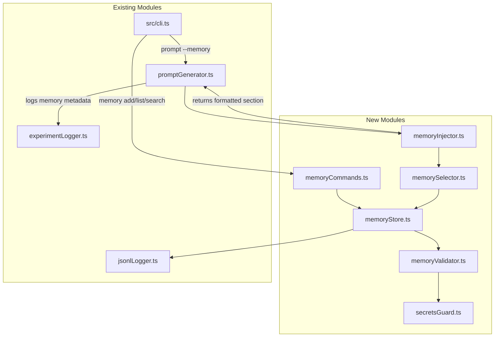

# Design Document: Development Memory

## Overview

Development Memory adds a structured "lessons learned" system to kiro-studio-kit. It stores short, typed memory entries in a JSONL file and injects relevant entries into generated prompts via rule-based scoring. The feature is designed as a lightweight, local-first solution — no vector databases, no external services, no new runtime dependencies.

### Key Design Decisions

1. **No Zod / No runtime dependencies**: The project currently has zero runtime dependencies. Rather than adding Zod as the first runtime dep, we implement lightweight schema validation using a hand-written validator module. This keeps the package lean and avoids dependency supply-chain concerns. The validator provides the same guarantees (type narrowing, error messages) without the bundle cost.

2. **Reuse existing JSONL infrastructure**: The project already has `jsonlLogger.ts` with `appendJsonlRecord` and `readJsonlFile`. The DevMemoryStore will reuse these utilities directly.

3. **Pure scoring function**: The MemorySelector is a pure function `(entries, taskText, mode) → selectedEntries` making it trivially testable with property-based tests.

4. **Prompt injection as a composable step**: Memory injection happens after prompt assembly but before output, as a string concatenation step. This avoids modifying the core `assemblePrompt` signature.

## Architecture



### Module Responsibilities

| Module | Responsibility |
|--------|---------------|
| `memoryValidator.ts` | Type definitions, validation functions (replaces Zod) |
| `secretsGuard.ts` | Detects secret patterns in text fields, emits warnings |
| `memoryStore.ts` | CRUD operations on `.kiro/ksk/dev-memory.jsonl` |
| `memorySelector.ts` | Pure scoring + filtering + selection logic |
| `memoryInjector.ts` | Orchestrates selection → formatting → section string |
| `memoryCommands.ts` | CLI handlers for `memory add/list/search` subcommands |

## Components and Interfaces

### memoryValidator.ts

```typescript
/** Memory entry kind — 8 allowed values */
export type DevMemoryKind =
  | "test_fix" | "type_fix" | "lint_fix" | "build_fix"
  | "schema_fix" | "behavior_change" | "design_decision" | "gotcha";

/** Severity levels */
export type Severity = "low" | "medium" | "high";

/** Confidence levels */
export type Confidence = "low" | "medium" | "high";

/** Memory mode for prompt injection */
export type MemoryMode = "auto" | "off" | "full";

/** A single development memory entry */
export interface DevMemoryEntry {
  id: string;
  createdAt: string;
  kind: DevMemoryKind;
  summary: string;
  trigger: string;
  fix: string;
  futurePromptHint: string;
  relatedFiles: string[];
  relatedSymbols: string[];
  tags: string[];
  severity: Severity;
  confidence: Confidence;
  enabled: boolean;
  // Optional fields
  project?: string;
  phase?: string;
  taskName?: string;
  supersedes?: string[];
  expiresAt?: string;
}

/** Validation result */
export interface ValidationResult {
  success: boolean;
  errors: string[];
}

/** Validate a DevMemoryEntry. Returns errors array (empty = valid). */
export function validateDevMemoryEntry(input: unknown): ValidationResult;

/** Type guard: narrows unknown to DevMemoryEntry if valid */
export function isValidDevMemoryEntry(input: unknown): input is DevMemoryEntry;

/** List of valid DevMemoryKind values */
export const VALID_KINDS: readonly DevMemoryKind[];

/** List of valid Severity values */
export const VALID_SEVERITIES: readonly Severity[];

/** List of valid Confidence values */
export const VALID_CONFIDENCES: readonly Confidence[];
```

### secretsGuard.ts

```typescript
/** Patterns that indicate potential secrets */
export const SECRET_PATTERNS: readonly RegExp[];

/** Check text fields for secret patterns. Returns warning messages (empty = clean). */
export function checkForSecrets(entry: DevMemoryEntry): string[];
```

### memoryStore.ts

```typescript
import type { DevMemoryEntry } from "./memoryValidator.js";

/** Default store path */
export const MEMORY_STORE_PATH: string; // ".kiro/ksk/dev-memory.jsonl"

/** Read all entries from the store. Skips invalid lines. */
export async function readMemoryEntries(storePath?: string): Promise<DevMemoryEntry[]>;

/** Append a validated entry to the store. Throws on validation failure. */
export async function appendMemoryEntry(
  entry: DevMemoryEntry,
  storePath?: string,
): Promise<string>;
```

### memorySelector.ts

```typescript
import type { DevMemoryEntry, MemoryMode } from "./memoryValidator.js";

/** Scored entry (internal) */
export interface ScoredEntry {
  entry: DevMemoryEntry;
  score: number;
}

/** Selection result */
export interface SelectionResult {
  selected: DevMemoryEntry[];
  totalAvailable: number;
}

/** Score a single entry against task text. Pure function. */
export function scoreEntry(entry: DevMemoryEntry, taskText: string): number;

/** Select entries based on mode, task text, and constraints. Pure function. */
export function selectMemoryEntries(
  entries: DevMemoryEntry[],
  taskText: string,
  mode: MemoryMode,
): SelectionResult;
```

### memoryInjector.ts

```typescript
import type { MemoryMode, DevMemoryEntry } from "./memoryValidator.js";

/** Injection metadata for logging */
export interface MemoryInjectionMeta {
  mode: MemoryMode;
  selectedCount: number;
  selectedIds: string[];
  totalAvailable: number;
}

/** Format selected entries into a prompt section string */
export function formatMemorySection(entries: DevMemoryEntry[]): string;

/** Full injection pipeline: read store → select → format. Returns section + metadata. */
export async function injectMemorySection(
  taskText: string,
  mode: MemoryMode,
  storePath?: string,
): Promise<{ section: string; meta: MemoryInjectionMeta }>;
```

### memoryCommands.ts

```typescript
/** Handle `memory add` subcommand */
export async function handleMemoryAdd(args: string[]): Promise<void>;

/** Handle `memory list` subcommand */
export async function handleMemoryList(args: string[]): Promise<void>;

/** Handle `memory search` subcommand */
export async function handleMemorySearch(args: string[]): Promise<void>;

/** Route `memory` subcommand to appropriate handler */
export async function handleMemory(args: string[]): Promise<void>;
```

## Data Models

### DevMemoryEntry (JSONL record)

```json
{
  "id": "550e8400-e29b-41d4-a716-446655440000",
  "createdAt": "2024-01-15T10:30:00.000Z",
  "kind": "test_fix",
  "summary": "vitest mock must be hoisted above imports",
  "trigger": "vi.mock() called after import statement",
  "fix": "Move vi.mock() to top of file, before any imports",
  "futurePromptHint": "Always place vi.mock() calls before import statements in test files",
  "relatedFiles": ["src/__tests__/cli.test.ts"],
  "relatedSymbols": ["vi.mock", "vitest"],
  "tags": ["testing", "vitest", "mock"],
  "severity": "medium",
  "confidence": "high",
  "enabled": true,
  "project": "kiro-studio-kit",
  "phase": "implementation",
  "taskName": "fix-cli-tests"
}
```

### Scoring Algorithm

The scoring is additive. For each enabled, non-expired, non-superseded, non-low-confidence entry:

| Condition | Points |
|-----------|--------|
| Any `relatedFiles` value found in task text | +5 per match |
| Any `relatedSymbols` value found in task text | +4 per match |
| Any `tags` value found in task text | +3 per match |
| `kind` is contextually relevant to task | +2 |
| `severity === "high"` | +2 |
| `severity === "medium"` | +1 |
| `createdAt` within last 30 days | +1 |

**Kind relevance mapping**: The `kind` field gets +2 if the task text contains keywords associated with that kind:
- `test_fix` → "test", "spec", "vitest", "jest"
- `type_fix` → "type", "typescript", "tsc", "typecheck"
- `lint_fix` → "lint", "eslint", "prettier"
- `build_fix` → "build", "compile", "bundle", "dist"
- `schema_fix` → "schema", "validation", "zod", "parse"
- `behavior_change` → "behavior", "breaking", "api"
- `design_decision` → "design", "architecture", "pattern"
- `gotcha` → (always +0, no keyword match — gotchas rely on other signals)

### Mode Constraints

| Mode | Filter | Limit | Character Cap |
|------|--------|-------|---------------|
| `auto` | score > 0 | top 5 | 2000 chars |
| `full` | enabled && confidence ≠ "low" | all | 10000 chars |
| `off` | — | 0 | — |

### Prompt Section Format

```markdown
## Development Memory / 再発防止メモ

> 以下は過去の修正から得た注意点です。今回の明示仕様と矛盾する場合は明示仕様を優先してください。

### 1. [summary] (kind)
- **Related**: [relatedFiles, relatedSymbols]
- **Trigger**: [trigger]
- **Fix**: [fix]
- **Hint**: [futurePromptHint]

### 2. ...
```

### ExperimentRecord Extension

```typescript
// Added to ExperimentRecord
developmentMemory?: {
  mode: MemoryMode;
  selectedCount: number;
  selectedIds: string[];
  totalAvailable: number;
};
```

### Validation Rules (replacing Zod)

The `validateDevMemoryEntry` function checks:
1. `input` is a non-null object
2. `id` is a non-empty string
3. `createdAt` is a non-empty string (ISO 8601 format)
4. `kind` is one of the 8 valid values
5. `summary` is a non-empty string
6. `trigger` is a non-empty string
7. `fix` is a non-empty string
8. `futurePromptHint` is a non-empty string
9. `relatedFiles` is an array of strings
10. `relatedSymbols` is an array of strings
11. `tags` is an array of strings
12. `severity` is one of "low" | "medium" | "high"
13. `confidence` is one of "low" | "medium" | "high"
14. `enabled` is a boolean
15. Optional fields: `project`, `phase`, `taskName` are strings if present; `supersedes` is string[] if present; `expiresAt` is string if present


## Correctness Properties

*A property is a characteristic or behavior that should hold true across all valid executions of a system — essentially, a formal statement about what the system should do. Properties serve as the bridge between human-readable specifications and machine-verifiable correctness guarantees.*

### Property 1: Validation accepts valid entries and rejects invalid entries

*For any* object that satisfies all DevMemoryEntry field constraints (non-empty required strings, valid enum values, correct array types, boolean enabled), `validateDevMemoryEntry` SHALL return `{ success: true, errors: [] }`. *For any* object that violates at least one constraint (empty required string, invalid kind/severity/confidence, non-array where array expected, missing required field), `validateDevMemoryEntry` SHALL return `{ success: false }` with a non-empty errors array.

**Validates: Requirements 1.1, 1.2, 1.3, 1.4, 1.5, 1.6, 1.7, 1.8**

### Property 2: JSONL serialization round-trip

*For any* valid DevMemoryEntry object, writing it to the JSONL store and then reading all entries back SHALL produce an array containing an object deeply equal to the original entry.

**Validates: Requirements 2.3, 2.4, 12.19**

### Property 3: Exclusion filter correctness

*For any* set of DevMemoryEntry objects and any task text, `selectMemoryEntries` SHALL never include an entry where `enabled === false`, `confidence === "low"`, `expiresAt` is in the past, or the entry's id appears in another entry's `supersedes` array.

**Validates: Requirements 6.1, 6.2, 6.3, 6.4**

### Property 4: Scoring additivity

*For any* valid, non-excluded DevMemoryEntry and any task text, `scoreEntry` SHALL return a score equal to the sum of: (+5 per relatedFiles match in task text) + (+4 per relatedSymbols match) + (+3 per tags match) + (+2 if kind keywords found in task text) + (+2 if severity is "high", +1 if "medium") + (+1 if createdAt within 30 days).

**Validates: Requirements 6.5, 6.6, 6.7, 6.8, 6.9, 6.10, 6.11**

### Property 5: Auto mode respects constraints

*For any* set of entries and task text, `selectMemoryEntries(entries, taskText, "auto")` SHALL return at most 5 entries, all with score > 0, with total formatted character count ≤ 2000, sorted by score descending.

**Validates: Requirements 6.12**

### Property 6: Full mode respects constraints

*For any* set of entries and task text, `selectMemoryEntries(entries, taskText, "full")` SHALL return only entries where `enabled === true` and `confidence !== "low"`, with total formatted character count ≤ 10000.

**Validates: Requirements 6.13**

### Property 7: Off mode returns empty selection

*For any* set of entries and task text, `selectMemoryEntries(entries, taskText, "off")` SHALL return an empty selection with `selectedCount === 0`.

**Validates: Requirements 6.14**

### Property 8: Memory section presence is determined by selection count

*For any* task text and memory mode, `formatMemorySection` returns a non-empty string (containing the section header) if and only if the input entries array is non-empty. When entries is empty, it returns an empty string.

**Validates: Requirements 7.4, 7.5**

### Property 9: Formatted entry contains all required fields

*For any* valid DevMemoryEntry, the formatted output of that entry SHALL contain the entry's summary, kind, trigger, fix, and futurePromptHint values as substrings.

**Validates: Requirements 7.6**

### Property 10: Search is case-insensitive

*For any* query string and set of entries, searching with the query in any casing (upper, lower, mixed) SHALL return the same set of matching entry ids.

**Validates: Requirements 5.4**

### Property 11: Secrets guard detects known patterns

*For any* DevMemoryEntry whose summary, trigger, fix, or futurePromptHint contains one of the defined secret patterns (`sk-`, `BEGIN PRIVATE KEY`, `password=`, `api_key`, `secret`), `checkForSecrets` SHALL return a non-empty warnings array.

**Validates: Requirements 9.1**

## Error Handling

### Validation Errors

- `validateDevMemoryEntry` returns structured errors with field-level messages
- CLI displays validation errors to stderr and exits with code 1
- Invalid entries are never written to the store

### File System Errors

- Missing store file → return empty array (read) or auto-create (write)
- Permission errors → throw with descriptive message (reuse `fileUtils.ts` patterns)
- Corrupt JSONL lines → skip with `console.warn`, continue processing remaining lines

### CLI Errors

- Missing required flags → display usage hint + exit code 1
- Invalid `--memory` value → display valid options + exit code 1
- Invalid `--kind` value → display valid kinds + exit code 1

### Secrets Guard

- Detection is advisory only — warns to stderr but does not block writes
- Pattern matching uses case-insensitive regex

## Testing Strategy

### Property-Based Tests (fast-check)

The project already uses `fast-check` for property-based testing. Each correctness property maps to one property-based test with minimum 100 iterations.

**Library**: `fast-check` (already in devDependencies)

**Test files**:
- `src/__tests__/memoryValidator.property.test.ts` — Properties 1
- `src/__tests__/memoryStore.property.test.ts` — Property 2
- `src/__tests__/memorySelector.property.test.ts` — Properties 3, 4, 5, 6, 7
- `src/__tests__/memoryInjector.property.test.ts` — Properties 8, 9
- `src/__tests__/memorySearch.property.test.ts` — Property 10
- `src/__tests__/secretsGuard.property.test.ts` — Property 11

**Configuration**: Each test runs with `{ numRuns: 100 }` minimum. Tag format:
```
Feature: dev-memory, Property {N}: {title}
```

### Generators (fast-check arbitraries)

```typescript
// Valid DevMemoryEntry generator
const validEntryArb: fc.Arbitrary<DevMemoryEntry> = fc.record({
  id: fc.uuid(),
  createdAt: fc.date().map(d => d.toISOString()),
  kind: fc.constantFrom(...VALID_KINDS),
  summary: fc.string({ minLength: 1, maxLength: 200 }),
  trigger: fc.string({ minLength: 1, maxLength: 200 }),
  fix: fc.string({ minLength: 1, maxLength: 200 }),
  futurePromptHint: fc.string({ minLength: 1, maxLength: 200 }),
  relatedFiles: fc.array(fc.string({ minLength: 1 }), { maxLength: 5 }),
  relatedSymbols: fc.array(fc.string({ minLength: 1 }), { maxLength: 5 }),
  tags: fc.array(fc.string({ minLength: 1 }), { maxLength: 5 }),
  severity: fc.constantFrom("low", "medium", "high"),
  confidence: fc.constantFrom("low", "medium", "high"),
  enabled: fc.boolean(),
});

// Task text that contains specific entry fields (for scoring tests)
const taskTextContainingArb = (entry: DevMemoryEntry) =>
  fc.constantFrom(
    ...entry.relatedFiles,
    ...entry.relatedSymbols,
    ...entry.tags,
  ).chain(keyword => fc.string().map(prefix => `${prefix} ${keyword} ...`));
```

### Unit Tests (vitest)

- `src/__tests__/memoryValidator.test.ts` — specific valid/invalid examples, edge cases
- `src/__tests__/memoryStore.test.ts` — file I/O, auto-creation, corrupt line handling
- `src/__tests__/memorySelector.test.ts` — specific scoring scenarios, mode behaviors
- `src/__tests__/memoryInjector.test.ts` — format output, section header, disclaimer
- `src/__tests__/memoryCommands.test.ts` — CLI flag parsing, defaults, error messages
- `src/__tests__/secretsGuard.test.ts` — specific pattern detection, non-blocking behavior

### Integration Tests

- Verify `generatePrompt` with `--memory auto` produces correct output
- Verify experiment log contains `developmentMemory` metadata
- Verify end-to-end: add entry → generate prompt → entry appears in output
