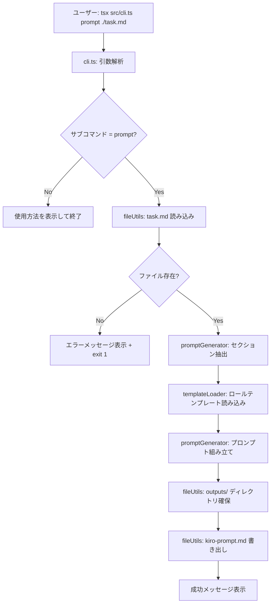
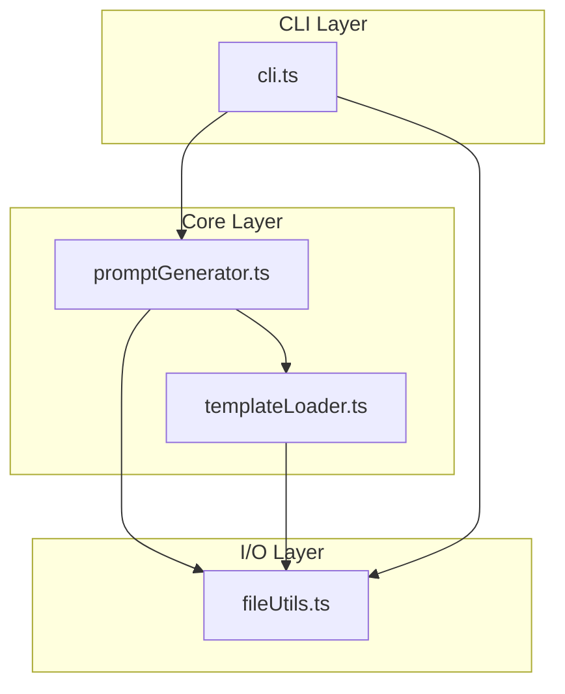

# 設計書: Kiro Studio Kit (Phase 1)

## 概要 (Overview)

Kiro Studio Kit Phase 1 は、`task.md` を入力として受け取り、構造化された `kiro-prompt.md` を生成する最小構成の TypeScript CLI ツールである。

本ツールは以下の処理パイプラインで動作する:

1. CLI がコマンドライン引数を解析し、`prompt` サブコマンドと `task.md` パスを受け取る
2. `fileUtils` が `task.md` を読み込む
3. `promptGenerator` が `task.md` の内容を解析し、Goal / Scope / Non-goals セクションを抽出する
4. `templateLoader` が `templates/roles/` 配下の4つのロールテンプレートを読み込む
5. `promptGenerator` が抽出したセクションとロールテンプレートを結合し、構造化プロンプトを組み立てる
6. `fileUtils` が `outputs/kiro-prompt.md` にファイルを書き出す

外部依存は `tsx`（開発実行用）のみとし、ランタイム依存は Node.js 標準ライブラリ（`fs/promises`, `path`）に限定する。



## アーキテクチャ (Architecture)

### ディレクトリ構成

```
kiro-studio-kit/
├── package.json
├── tsconfig.json
├── src/
│   ├── cli.ts                    # エントリポイント・引数解析
│   └── core/
│       ├── promptGenerator.ts    # セクション抽出・プロンプト組み立て
│       ├── templateLoader.ts     # ロールテンプレート読み込み
│       └── fileUtils.ts          # ファイル I/O ユーティリティ
├── templates/
│   └── roles/
│       ├── director.md           # ディレクター役割定義
│       ├── architect.md          # アーキテクト役割定義
│       ├── implementer.md        # 実装者役割定義
│       └── qa.md                 # QA 役割定義
└── outputs/
    └── .gitkeep
```

### レイヤー構成

本ツールは3層のシンプルなレイヤー構成を採用する:



- **CLI Layer**: エントリポイント。引数解析、エラーハンドリング、プロセス終了コード管理
- **Core Layer**: ビジネスロジック。セクション抽出、テンプレート結合、プロンプト組み立て
- **I/O Layer**: ファイル読み書きの抽象化。`fs/promises` と `path` のラッパー

### 設計判断

1. **外部パーサーライブラリ不使用**: task.md のセクション抽出は正規表現ベースで行う。Markdown パーサー（remark 等）は Phase 1 の要件に対してオーバースペックであり、依存を最小化する方針に合致しない。
2. **テンプレートは静的ファイル**: ロールテンプレートは Handlebars 等のテンプレートエンジンを使わず、プレーンな Markdown ファイルとして管理する。Phase 1 では変数展開が不要なため。
3. **`tsx` による直接実行**: ビルドステップなしで `tsx src/cli.ts` で実行可能とする。`npm run studio:prompt` スクリプトで引数転送を行う。


## コンポーネントとインターフェース (Components and Interfaces)

### cli.ts — エントリポイント

```typescript
// src/cli.ts
// 責務: 引数解析、サブコマンドのディスパッチ、エラーハンドリング、終了コード管理

async function main(): Promise<void>;
// process.argv を解析し、prompt サブコマンドを実行する
// 引数不足時は usage メッセージを表示して exit(1)
// 未知のサブコマンドは usage メッセージを表示して exit(1)
```

### promptGenerator.ts — プロンプト生成コア

```typescript
// src/core/promptGenerator.ts

/** task.md から抽出されたセクション */
interface ParsedTask {
  goal: string;
  scope: string;
  nonGoals: string;
}

/** task.md の生テキストからセクションを抽出する */
function parseTaskFile(content: string): ParsedTask;
// - `## Goal` セクションを抽出。存在しない場合は空文字列
// - `## Scope` セクションを抽出。存在しない場合はデフォルトプレースホルダー
// - `## Non-goals` セクションを抽出。存在しない場合はデフォルトプレースホルダー

/** ロールテンプレートの集合 */
interface RoleTemplates {
  director: string;
  architect: string;
  implementer: string;
  qa: string;
}

/** ParsedTask とロールテンプレートから kiro-prompt.md の内容を組み立てる */
function assemblePrompt(task: ParsedTask, roles: RoleTemplates): string;
// Goal → Scope → Non-goals → Role Sequence の順でセクションを結合

/** メインのプロンプト生成フロー */
async function generatePrompt(taskFilePath: string): Promise<string>;
// 1. taskFilePath からファイル読み込み
// 2. parseTaskFile でセクション抽出
// 3. templateLoader でロールテンプレート読み込み
// 4. assemblePrompt でプロンプト組み立て
// 5. outputs/kiro-prompt.md に書き出し
// 6. 出力ファイルパスを返す
```

### templateLoader.ts — テンプレート読み込み

```typescript
// src/core/templateLoader.ts

/** 4つのロールテンプレートをすべて読み込む */
async function loadRoleTemplates(): Promise<RoleTemplates>;
// templates/roles/ 配下の director.md, architect.md, implementer.md, qa.md を読み込む
// いずれかが存在しない場合は、どのファイルが見つからないかを示すエラーをスローする

/** テンプレートディレクトリのベースパスを解決する */
function getTemplatesDir(): string;
// プロジェクトルートからの相対パスを解決
```

### fileUtils.ts — ファイル I/O ユーティリティ

```typescript
// src/core/fileUtils.ts

/** ファイルを UTF-8 テキストとして読み込む */
async function readTextFile(filePath: string): Promise<string>;
// ファイルが存在しない場合はわかりやすいエラーメッセージをスロー

/** テキストをファイルに書き出す（ディレクトリが存在しない場合は作成） */
async function writeTextFile(filePath: string, content: string): Promise<void>;
// 親ディレクトリが存在しない場合は recursive: true で作成

/** ファイルの存在確認 */
async function fileExists(filePath: string): Promise<boolean>;
```

## データモデル (Data Models)

### ParsedTask

task.md から抽出されるセクションデータ:

| フィールド | 型 | 説明 | デフォルト値 |
|---|---|---|---|
| `goal` | `string` | `## Goal` セクションの内容 | `""` (空文字列) |
| `scope` | `string` | `## Scope` セクションの内容 | `"（Scope は task.md に記載されていません。必要に応じて定義してください。）"` |
| `nonGoals` | `string` | `## Non-goals` セクションの内容 | `"（Non-goals は task.md に記載されていません。必要に応じて定義してください。）"` |

### RoleTemplates

ロールテンプレートの集合:

| フィールド | 型 | 説明 |
|---|---|---|
| `director` | `string` | director.md の内容 |
| `architect` | `string` | architect.md の内容 |
| `implementer` | `string` | implementer.md の内容 |
| `qa` | `string` | qa.md の内容 |

### Kiro Prompt 出力構造

生成される `kiro-prompt.md` のセクション構成:

```markdown
# Kiro Prompt

## Goal
{task.md から抽出した Goal}

## Scope
{task.md から抽出した Scope、またはデフォルトプレースホルダー}

## Non-goals
{task.md から抽出した Non-goals、またはデフォルトプレースホルダー}

## Role Sequence

### 1. Director
{director.md の内容}

### 2. Architect
{architect.md の内容}

### 3. Implementer
{implementer.md の内容}

### 4. QA
{qa.md の内容}
```

### セクション抽出ロジック

`## SectionName` ヘッダーから次の `## ` ヘッダー（またはファイル末尾）までのテキストを抽出する。正規表現パターン:

```
/^## <SectionName>\s*\n([\s\S]*?)(?=^## |\Z)/m
```

- ヘッダー行自体は抽出結果に含めない
- 抽出したテキストの前後の空白は trim する
- マッチしない場合はデフォルト値を使用する


## 正当性プロパティ (Correctness Properties)

*プロパティとは、システムのすべての有効な実行において真であるべき特性や振る舞いのことである。人間が読める仕様と、機械で検証可能な正当性保証の橋渡しとなる形式的な記述である。*

### Property 1: セクション抽出ラウンドトリップ

*任意の* Goal、Scope、Non-goals の内容文字列について、それらを `## Goal`、`## Scope`、`## Non-goals` ヘッダー付きの Markdown ドキュメントに埋め込み、`parseTaskFile` で解析した結果は、元の各セクション内容と一致すること。

**Validates: Requirements 2.2, 2.3, 2.4**

### Property 2: 欠落セクションのデフォルトプレースホルダー

*任意の* `## Scope` ヘッダーを含まない Markdown テキストについて、`parseTaskFile` は Scope フィールドにデフォルトプレースホルダーを返すこと。同様に、`## Non-goals` ヘッダーを含まない Markdown テキストについて、Non-goals フィールドにデフォルトプレースホルダーを返すこと。

**Validates: Requirements 2.5, 2.6**

### Property 3: 出力セクション順序の保証

*任意の* 有効な `ParsedTask` と `RoleTemplates` について、`assemblePrompt` が生成する出力は、Goal → Scope → Non-goals → Role Sequence（Director → Architect → Implementer → QA）の順序でセクションが配置されていること。

**Validates: Requirements 4.2, 4.3**

### Property 4: ラウンドトリップ完全性

*任意の* 有効な task.md 入力について、`promptGenerator` が生成する `kiro-prompt.md` は、Goal、Scope、Non-goals、Role Sequence のすべての必須セクションを含むこと。

**Validates: Requirements 4.6**

## エラーハンドリング (Error Handling)

### エラー分類と対応

| エラー種別 | 発生箇所 | 対応 | 終了コード |
|---|---|---|---|
| 引数不足 | cli.ts | 使用方法メッセージを表示 | 1 |
| 未知のサブコマンド | cli.ts | 使用方法メッセージを表示 | 1 |
| task.md が存在しない | fileUtils.ts | `エラー: ファイルが見つかりません: {path}` | 1 |
| ロールテンプレートが存在しない | templateLoader.ts | `エラー: テンプレートファイルが見つかりません: {filename}` | 1 |
| ファイル読み込み権限エラー | fileUtils.ts | `エラー: ファイルを読み込めません: {path}` | 1 |
| ファイル書き込みエラー | fileUtils.ts | `エラー: ファイルを書き込めません: {path}` | 1 |
| 予期しないエラー | cli.ts (トップレベル catch) | `予期しないエラーが発生しました: {message}` | 1 |

### エラーハンドリング方針

1. **cli.ts がトップレベルのエラーバウンダリ**: すべての未処理例外を `try-catch` で捕捉し、ユーザーフレンドリーなメッセージを表示して `process.exit(1)` で終了する。
2. **Core Layer はエラーをスロー**: `promptGenerator.ts` と `templateLoader.ts` は適切なエラーメッセージ付きの `Error` をスローする。CLI Layer がキャッチして表示する。
3. **I/O Layer はエラーを変換**: `fileUtils.ts` は Node.js のファイルシステムエラー（`ENOENT`, `EACCES` 等）をわかりやすいメッセージに変換してスローする。
4. **Goal セクション欠落は警告なし**: task.md に `## Goal` がない場合、空文字列として扱う（エラーにはしない）。Phase 1 では最小限の制約とする。

## テスト戦略 (Testing Strategy)

### テストフレームワーク

- **ユニットテスト / プロパティテスト**: [Vitest](https://vitest.dev/) + [fast-check](https://fast-check.dev/)
- Vitest は TypeScript ネイティブサポートがあり、`tsx` との親和性が高い
- fast-check は TypeScript 向けの成熟したプロパティベーステストライブラリ

### テスト構成

```
src/
└── __tests__/
    ├── promptGenerator.test.ts   # parseTaskFile, assemblePrompt のテスト
    ├── templateLoader.test.ts    # loadRoleTemplates のテスト
    └── fileUtils.test.ts         # readTextFile, writeTextFile のテスト
```

### プロパティベーステスト

各正当性プロパティに対して、fast-check を使用したプロパティベーステストを実装する:

- **最小 100 イテレーション** で実行
- 各テストにプロパティ番号をタグ付け
- タグ形式: `Feature: kiro-studio-kit, Property {number}: {property_text}`

| プロパティ | テスト対象関数 | ジェネレータ |
|---|---|---|
| Property 1: セクション抽出ラウンドトリップ | `parseTaskFile` | ランダムな Markdown テキスト（`## Goal`, `## Scope`, `## Non-goals` セクション付き） |
| Property 2: 欠落セクションのデフォルト | `parseTaskFile` | `## Scope` / `## Non-goals` を含まないランダムな Markdown テキスト |
| Property 3: 出力セクション順序 | `assemblePrompt` | ランダムな `ParsedTask` と `RoleTemplates` |
| Property 4: ラウンドトリップ完全性 | `assemblePrompt` | ランダムな `ParsedTask` と `RoleTemplates` |

### ユニットテスト（例示ベース）

プロパティテストを補完する具体的なテストケース:

- **parseTaskFile**: 空ファイル、Goal のみ、全セクション含む、セクション順序が異なる場合
- **templateLoader**: 正常読み込み、テンプレートファイル欠落時のエラー
- **fileUtils**: 存在しないファイルの読み込みエラー、ディレクトリ自動作成
- **CLI**: 引数なし実行、正常実行、存在しないファイル指定

### テスト実行

```bash
# ユニットテスト + プロパティテスト
npx vitest --run

# 型チェック
npx tsc --noEmit
```
