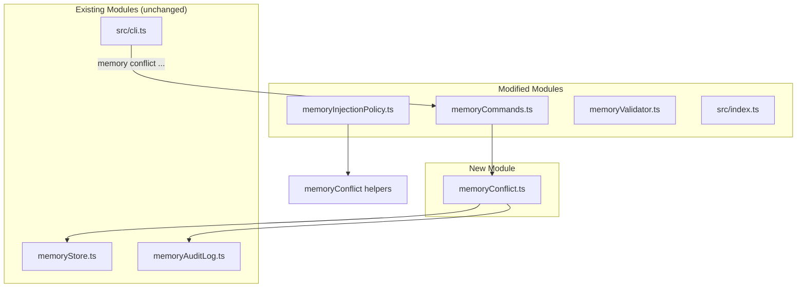

# Design Document: Memory Conflict Management

## Overview

Memory Conflict Management (Phase 4-K) adds explicit conflict resolution and supersession tracking to the Development Memory system. It enables developers to group entries that address the same concern (conflict groups) and to formally supersede older entries with newer ones. The injection policy is extended to exclude superseded entries and limit each conflict group to a single winner.

### Key Design Decisions

1. **Reuse existing `conflictKey` field**: The `DevMemoryEntry` interface already has an optional `conflictKey: string` field (added in Phase 4-A for health monitoring). This field is reused as the conflict group identifier — no new field needed for grouping.

2. **Bidirectional supersession tracking**: When entry A supersedes entry B, both sides are updated: B gets `supersededBy = A.id` and A's `supersedes` array includes B.id. This makes lookups efficient in both directions.

3. **New module `memoryConflict.ts`**: All conflict management logic lives in a dedicated module with pure helper functions and persistence wrappers. This keeps the injection policy module focused on its pipeline role.

4. **Non-blocking audit**: Audit event writes use try/catch with silent failure, consistent with the existing pattern in `memoryCommands.ts`.

5. **Conflict resolution placement in pipeline**: The conflict resolution step is inserted after high-rejection exclusion (Step 2) and before the trust-priority sort (Step 3) in `applyMemoryInjectionPolicy`. This ensures superseded/conflicting entries are removed before sorting and limit enforcement.

## Architecture



### Module Responsibilities

| Module | Responsibility |
|--------|---------------|
| `memoryConflict.ts` (new) | Pure helpers for conflict detection + persistence wrappers for supersede/group operations |
| `memoryValidator.ts` (modified) | Add `supersededBy` and `disabledReason` optional field validation |
| `memoryInjectionPolicy.ts` (modified) | Add supersession exclusion + conflict group resolution step |
| `memoryCommands.ts` (modified) | Add `conflict` subcommand routing (group/supersede/inspect/list) |
| `src/index.ts` (modified) | Export new public API symbols |

## Components and Interfaces

### Schema Extension (memoryValidator.ts)

Add to the `DevMemoryEntry` interface:

```typescript
export interface DevMemoryEntry {
  // ... existing fields ...

  // Conflict Management fields (Phase 4-K)
  supersededBy?: string;    // ID of the entry that supersedes this one
  disabledReason?: string;  // Why the entry was disabled: "superseded", "manual", "conflict_resolution"
}
```

Add validation rules in `validateDevMemoryEntry`:

```typescript
// Phase 4-K: Conflict Management fields
if (obj["supersededBy"] !== undefined && typeof obj["supersededBy"] !== "string") {
  errors.push("supersededBy must be a string if provided");
}
if (obj["disabledReason"] !== undefined && typeof obj["disabledReason"] !== "string") {
  errors.push("disabledReason must be a string if provided");
}
```

### memoryConflict.ts (New Module)

```typescript
import type { DevMemoryEntry } from "./memoryValidator.js";

// ---------------------------------------------------------------------------
// Pure Helper Functions
// ---------------------------------------------------------------------------

/**
 * Check if an entry is superseded (has a non-empty supersededBy field).
 * Pure function.
 */
export function isSupersededMemory(entry: DevMemoryEntry): boolean;

/**
 * Group entries by their conflictKey.
 * Returns a Map where keys are conflictKey values and values are arrays of entries.
 * Entries without a conflictKey are not included.
 * Pure function.
 */
export function groupByConflictGroup(entries: DevMemoryEntry[]): Map<string, DevMemoryEntry[]>;

/**
 * Select conflict winners from grouped entries.
 * For each conflict group, selects the entry with the highest trust priority.
 * Ties are broken by original array order (stable).
 * Returns a Set of winner entry IDs.
 * Pure function.
 */
export function selectConflictWinners(
  entries: DevMemoryEntry[],
): Set<string>;

// ---------------------------------------------------------------------------
// Persistence Functions
// ---------------------------------------------------------------------------

export interface SupersedeResult {
  oldEntry: DevMemoryEntry;
  newEntry: DevMemoryEntry;
  auditSuccess: boolean;
}

/**
 * Supersede an older entry with a newer one.
 * - Sets older entry: enabled=false, disabledReason="superseded", supersededBy=newerId
 * - Sets newer entry: supersedes=[...existing, oldId]
 * - Persists via rewriteMemoryEntries
 * - Emits audit event (non-blocking)
 *
 * Throws if oldId or newerId not found.
 */
export async function supersedeMemory(
  oldId: string,
  newerId: string,
  storePath?: string,
): Promise<SupersedeResult>;

export interface SetConflictGroupResult {
  updatedIds: string[];
  conflictKey: string;
  auditSuccess: boolean;
}

/**
 * Assign a conflict group key to multiple entries.
 * - Sets conflictKey on each specified entry
 * - Requires at least 2 IDs (throws otherwise)
 * - Throws if any ID not found
 * - Persists via rewriteMemoryEntries
 * - Emits audit event (non-blocking)
 */
export async function setMemoryConflictGroup(
  conflictKey: string,
  ids: string[],
  storePath?: string,
): Promise<SetConflictGroupResult>;
```

### Injection Policy Integration (memoryInjectionPolicy.ts)

The `applyMemoryInjectionPolicy` function pipeline is extended:

**Current pipeline:**
1. Exclude ineligible (deleted, disabled, discarded)
2. Exclude high rejection entries
3. Stable sort by trust priority
4. Enforce maxTotalEntries
5. Enforce maxProbationEntries
6. Enforce maxAutoCapturedRatio

**New pipeline:**
1. Exclude ineligible (deleted, disabled, discarded)
2. Exclude high rejection entries
3. **Exclude superseded entries** (new — `supersededBy` is non-empty)
4. **Resolve conflict groups** (new — keep only winner per `conflictKey`)
5. Stable sort by trust priority
6. Enforce maxTotalEntries
7. Enforce maxProbationEntries
8. Enforce maxAutoCapturedRatio

Extended stats interface:

```typescript
export interface MemoryInjectionPolicyResult {
  // ... existing fields ...
  stats: {
    inputCount: number;
    outputCount: number;
    excludedCount: number;
    probationIncludedCount: number;
    autoCapturedIncludedCount: number;
    highRejectionExcludedCount: number;
    supersededExcludedCount: number;      // NEW
    conflictExcludedCount: number;        // NEW
  };
}
```

Implementation additions in `applyMemoryInjectionPolicy`:

```typescript
import { isSupersededMemory, selectConflictWinners, groupByConflictGroup } from "./memoryConflict.js";

// After Step 2 (high rejection exclusion):

// Step 3: Exclude superseded entries
let supersededExcludedCount = 0;
const afterSuperseded: DevMemoryEntry[] = [];
for (const entry of afterRejection) {
  if (isSupersededMemory(entry)) {
    decisions.push({
      id: entry.id,
      action: "exclude",
      reason: `Superseded by ${entry.supersededBy}`,
    });
    supersededExcludedCount++;
  } else {
    afterSuperseded.push(entry);
  }
}

// Step 4: Resolve conflict groups (max 1 per conflictKey)
let conflictExcludedCount = 0;
const winnerIds = selectConflictWinners(afterSuperseded);
const afterConflict: DevMemoryEntry[] = [];
const conflictGroups = groupByConflictGroup(afterSuperseded);

for (const entry of afterSuperseded) {
  if (!entry.conflictKey) {
    // No conflict group — always include
    afterConflict.push(entry);
  } else if (winnerIds.has(entry.id)) {
    // Winner of its conflict group
    afterConflict.push(entry);
  } else {
    // Loser in conflict group
    const group = conflictGroups.get(entry.conflictKey);
    const winner = group?.find(e => winnerIds.has(e.id));
    decisions.push({
      id: entry.id,
      action: "exclude",
      reason: `Conflict group '${entry.conflictKey}' — winner is ${winner?.id ?? "unknown"}`,
    });
    conflictExcludedCount++;
  }
}

// Continue with Step 5 (sort) using afterConflict instead of afterRejection
```

### CLI Routing (memoryCommands.ts)

Add a `handleMemoryConflict` function and route it from `handleMemory`:

```typescript
/** Handle `memory conflict` subcommand */
export async function handleMemoryConflict(args: string[]): Promise<void> {
  const subcommand = args[0];

  switch (subcommand) {
    case "group":
      await handleConflictGroup(args.slice(1));
      break;
    case "supersede":
      await handleConflictSupersede(args.slice(1));
      break;
    case "inspect":
      await handleConflictInspect(args.slice(1));
      break;
    case "list":
      await handleConflictList();
      break;
    default:
      showConflictUsage();
      process.exit(1);
  }
}

/** Handle `memory conflict group <conflictKey> <id1> <id2> [id3...]` */
async function handleConflictGroup(args: string[]): Promise<void>;

/** Handle `memory conflict supersede <oldId> <newId>` */
async function handleConflictSupersede(args: string[]): Promise<void>;

/** Handle `memory conflict inspect <id>` */
async function handleConflictInspect(args: string[]): Promise<void>;

/** Handle `memory conflict list` — display all conflict groups */
async function handleConflictList(): Promise<void>;
```

### Audit Events

Both `supersedeMemory` and `setMemoryConflictGroup` emit audit events using the existing `appendMemoryAuditEvent` function:

**Supersede audit event:**
```json
{
  "eventType": "manual_update",
  "actor": "cli",
  "memoryId": "<oldId>",
  "source": "memoryConflict.supersedeMemory",
  "metadata": {
    "operation": "supersede",
    "oldId": "<oldId>",
    "newerId": "<newerId>"
  },
  "before": { "enabled": true, "supersededBy": null },
  "after": { "enabled": false, "supersededBy": "<newerId>", "disabledReason": "superseded" }
}
```

**Set conflict group audit event:**
```json
{
  "eventType": "manual_update",
  "actor": "cli",
  "source": "memoryConflict.setMemoryConflictGroup",
  "metadata": {
    "operation": "set_conflict_group",
    "conflictKey": "<key>",
    "ids": ["<id1>", "<id2>"]
  }
}
```

### Public API Exports (src/index.ts)

```typescript
// From memoryConflict.ts
export {
  isSupersededMemory,
  groupByConflictGroup,
  selectConflictWinners,
  supersedeMemory,
  setMemoryConflictGroup,
} from "./core/memoryConflict.js";
export type { SupersedeResult, SetConflictGroupResult } from "./core/memoryConflict.js";
```

## Data Models

### Superseded Entry Example

```json
{
  "id": "old-entry-001",
  "enabled": false,
  "disabledReason": "superseded",
  "supersededBy": "new-entry-002",
  "conflictKey": "vitest-mock-hoisting",
  "kind": "test_fix",
  "summary": "vi.mock must be before imports (outdated approach)",
  "...": "..."
}
```

### Superseding Entry Example

```json
{
  "id": "new-entry-002",
  "enabled": true,
  "supersedes": ["old-entry-001"],
  "conflictKey": "vitest-mock-hoisting",
  "kind": "test_fix",
  "summary": "vi.mock must use factory pattern with hoisting",
  "...": "..."
}
```

### Conflict Group Resolution Algorithm

For entries sharing the same `conflictKey`:
1. Compute trust priority for each entry using `getTrustPriority` (verified=300, trusted=200, probation=100, default=50)
2. Select the entry with the highest trust priority as the winner
3. If multiple entries share the highest priority, the one appearing first in the original array wins (stable selection)
4. All non-winner entries in the group are excluded with a decision reason

## Correctness Properties

### Property 1: Superseded entries never injected

*For any* set of DevMemoryEntry objects where at least one entry has a non-empty `supersededBy` field, `applyMemoryInjectionPolicy` SHALL never include that entry in `selectedEntries`.

**Validates: Requirements 4.1**

### Property 2: At most one entry per conflict group

*For any* set of DevMemoryEntry objects, `applyMemoryInjectionPolicy` SHALL include at most 1 entry per unique `conflictKey` value in `selectedEntries`.

**Validates: Requirements 4.2**

### Property 3: Conflict winner has highest trust

*For any* conflict group (set of entries sharing the same `conflictKey`) where at least one entry passes all other exclusion criteria, the included entry (if any) SHALL have a trust priority >= all other entries in the same group that also pass exclusion criteria.

**Validates: Requirements 4.3**

### Property 4: Supersede never deletes

*For any* valid pair of entry IDs in the store, calling `supersedeMemory(oldId, newerId)` SHALL result in the store containing the same number of entries as before the call (no physical deletion).

**Validates: Requirements 2.10**

### Property 5: setConflictGroup updates exactly requested IDs

*For any* valid conflictKey and set of 2+ valid entry IDs, calling `setMemoryConflictGroup(conflictKey, ids)` SHALL result in exactly those entries having `conflictKey` set to the provided value, and all other entries in the store SHALL have their `conflictKey` unchanged.

**Validates: Requirements 3.7**

## Error Handling

### Persistence Errors

- Missing entry ID → throw `Error` with message identifying the missing ID
- Fewer than 2 IDs for conflict group → throw `Error` with descriptive message
- Store read/write failures → propagate from `memoryStore.ts` (existing behavior)

### Audit Errors

- Audit write failure → catch silently, set `auditSuccess = false` in result
- Consistent with existing pattern in `memoryCommands.ts`

### CLI Errors

- Missing required arguments → display usage help + exit code 1
- Entry not found → display error to stderr + exit code 1
- Invalid subcommand → display usage help + exit code 1

## Testing Strategy

### Property-Based Tests (fast-check)

**File**: `src/__tests__/memoryConflict.property.test.ts`

| Property | Description | Runs |
|----------|-------------|------|
| 1 | Superseded entries never in policy output | 100 |
| 2 | Max 1 entry per conflictKey in policy output | 100 |
| 3 | Winner has highest trust priority in group | 100 |
| 4 | supersedeMemory preserves entry count | 100 |
| 5 | setConflictGroup updates exactly requested IDs | 100 |

**Generators:**

```typescript
// Entry with optional conflict fields
const conflictEntryArb = fc.record({
  id: fc.uuid(),
  createdAt: fc.date().map(d => d.toISOString()),
  kind: fc.constantFrom(...VALID_KINDS),
  summary: fc.string({ minLength: 1, maxLength: 100 }),
  trigger: fc.string({ minLength: 1, maxLength: 100 }),
  fix: fc.string({ minLength: 1, maxLength: 100 }),
  futurePromptHint: fc.string({ minLength: 1, maxLength: 100 }),
  relatedFiles: fc.array(fc.string({ minLength: 1 }), { maxLength: 3 }),
  relatedSymbols: fc.array(fc.string({ minLength: 1 }), { maxLength: 3 }),
  tags: fc.array(fc.string({ minLength: 1 }), { maxLength: 3 }),
  severity: fc.constantFrom("low", "medium", "high"),
  confidence: fc.constantFrom("low", "medium", "high"),
  enabled: fc.constant(true),
  trustLevel: fc.constantFrom("probation", "trusted", "verified"),
  conflictKey: fc.option(fc.string({ minLength: 1, maxLength: 20 }), { nil: undefined }),
  supersededBy: fc.option(fc.uuid(), { nil: undefined }),
});

// Array of entries with some sharing conflictKeys
const conflictGroupEntriesArb = fc.array(conflictEntryArb, { minLength: 2, maxLength: 10 })
  .map(entries => {
    // Assign shared conflictKey to some entries
    const key = "shared-conflict";
    const groupSize = Math.min(3, entries.length);
    for (let i = 0; i < groupSize; i++) {
      entries[i].conflictKey = key;
      entries[i].supersededBy = undefined; // not superseded
    }
    return entries;
  });
```

### Unit Tests (vitest)

**File**: `src/__tests__/memoryConflict.test.ts`

- `isSupersededMemory` returns true/false correctly
- `groupByConflictGroup` groups entries by conflictKey
- `selectConflictWinners` picks highest trust priority
- `selectConflictWinners` is stable (first entry wins ties)
- `supersedeMemory` sets all fields correctly
- `supersedeMemory` throws on missing oldId
- `supersedeMemory` throws on missing newerId
- `setMemoryConflictGroup` sets conflictKey on all specified entries
- `setMemoryConflictGroup` throws when fewer than 2 IDs
- `setMemoryConflictGroup` throws on missing ID
- Injection policy excludes superseded entries
- Injection policy limits conflict groups to 1 winner
- CLI `conflict group` calls setMemoryConflictGroup
- CLI `conflict supersede` calls supersedeMemory
- CLI `conflict list` displays grouped entries
- CLI `conflict inspect` shows conflict fields

### Integration Tests

- End-to-end: supersede via CLI → verify injection excludes old entry
- End-to-end: set conflict group → verify injection picks winner
- Audit log contains correct events after supersede and group operations

