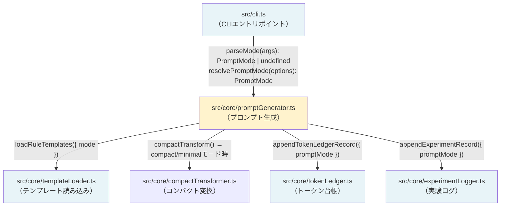

# Design Document: prompt-mode-support

## Overview

`kiro-studio-kit` の `prompt` コマンドにプロンプト生成モード機能を追加する。現在は `--compact` フラグのみで通常モードとコンパクトモードを切り替えているが、これを拡張して `full`・`compact`・`minimal` の3モードを `--mode` オプションで指定できるようにする。

### 変更の目的

- **`full` モード**: 現在の通常モードと同等。Director/Architect/Implementer/QA の詳細な役割分担を含む完全なプロンプトを生成する
- **`compact` モード**: 現在の `--compact` フラグと同等。compactTransform + trimSection を適用してトークン数を削減する
- **`minimal` モード**: 新規追加。小さい修正・継続作業向けの軽量プロンプトを生成する。役割分担セクションを省略し、必須ルールと品質ゲートのみを含む

### 設計方針

1. **後方互換性の維持**: 既存の `--compact` フラグは引き続き動作する
2. **単一責任の原則**: モード解決ロジックを `resolvePromptMode` 関数に集約し、`compact?: boolean` の直接参照を排除する
3. **最小変更**: 既存の `assemblePrompt` 関数の構造を維持しつつ、minimal モード用の新しい関数を追加する

---

## Architecture

### 変更対象モジュールと依存関係



### 変更の概要

| モジュール | 変更内容 |
|---|---|
| `src/cli.ts` | `parseMode()` 追加、`handlePrompt()` を `--mode` 対応に更新 |
| `src/core/promptGenerator.ts` | `PromptMode` 型・`resolvePromptMode` 追加、`GenerateOptions` 拡張、`assembleMinimalPrompt` 追加、ログ呼び出し更新 |
| `src/core/templateLoader.ts` | `LoadRuleOptions` に `mode?: PromptMode` 追加（`compact` は維持） |
| `src/core/tokenLedger.ts` | `TokenLedgerRecord` に `promptMode` フィールド追加 |
| `src/core/experimentLogger.ts` | `ExperimentRecord` に `promptMode` フィールド追加 |

---

## Components and Interfaces

### 型設計

#### `PromptMode` 型

```typescript
// src/core/promptGenerator.ts に追加
export type PromptMode = "full" | "compact" | "minimal";
```

#### `GenerateOptions` の拡張

```typescript
// 変更前
export interface GenerateOptions {
  compact?: boolean;
}

// 変更後
export interface GenerateOptions {
  mode?: PromptMode;       // 新規追加: 明示的なモード指定
  compact?: boolean;       // 後方互換のため維持
  outputDir?: string;      // 将来の拡張用（現在は generatePrompt の引数として渡す）
}
```

#### `resolvePromptMode` 関数

```typescript
/**
 * GenerateOptions からプロンプトモードを解決する。
 * 優先順位: options.mode > options.compact > デフォルト("full")
 */
export function resolvePromptMode(options: GenerateOptions): PromptMode {
  if (options.mode) return options.mode;
  if (options.compact) return "compact";
  return "full";
}
```

### CLIの変更設計

#### `parseMode` 関数

```typescript
// src/cli.ts に追加
const VALID_MODES: PromptMode[] = ["full", "compact", "minimal"];

/**
 * CLI引数から --mode <value> を抽出する。
 * 不正値の場合は null を返す（エラー処理は呼び出し元で行う）。
 */
export function parseMode(args: string[]): { mode: PromptMode | null; invalid: string | null } {
  const modeIndex = args.indexOf("--mode");
  if (modeIndex === -1) {
    return { mode: null, invalid: null };
  }
  const value = args[modeIndex + 1];
  if (!value || value.startsWith("--")) {
    return { mode: null, invalid: "" };
  }
  if (VALID_MODES.includes(value as PromptMode)) {
    return { mode: value as PromptMode, invalid: null };
  }
  return { mode: null, invalid: value };
}
```

#### `handlePrompt` の変更

```typescript
async function handlePrompt(args: string[]): Promise<void> {
  // ... タスクファイルパスの解析（既存）

  const outputDir = parseOutputDir(args);
  const compact = parseCompactFlag(args);
  const { mode, invalid } = parseMode(args);

  // 不正値チェック
  if (invalid !== null) {
    console.error(`エラー: --mode に無効な値 "${invalid}" が指定されました。`);
    console.error(`有効な値: full, compact, minimal`);
    process.exit(1);
  }

  // 両方指定時の警告
  if (compact && mode !== null) {
    console.error(`警告: --compact と --mode が同時に指定されました。--mode "${mode}" を優先します。`);
  }

  const result = await generatePrompt(taskFilePath, outputDir, { compact, mode: mode ?? undefined });
  // ... 結果出力（既存 + promptMode 表示）
}
```

#### `showUsage` の更新

```
Usage:
  kiro-studio-kit prompt <task-file> [--out <output-dir>] [--mode <full|compact|minimal>] [--compact]
  kiro-studio-kit summary

Options:
  --out <dir>                出力ディレクトリを指定する（デフォルト: outputs）
  --mode <full|compact|minimal>  プロンプト生成モードを指定する（デフォルト: full）
  --compact                  コンパクトモードでプロンプトを生成する（後方互換、--mode compact と同等）
```

---

## Data Models

### `TokenLedgerRecord` の拡張

```typescript
// src/core/tokenLedger.ts
export interface TokenLedgerRecord {
  runId: string;
  timestamp: string;
  taskFile: string;
  mode: "economy";
  promptMode: PromptMode;          // 新規追加: "full" | "compact" | "minimal"
  files: { ... };
  estimatedTokens: { ... };
  limits: { ... };
  economyFeatures: { ... };
  compactMode?: {                  // 既存フィールド（互換性維持）
    enabled: boolean;
    tokensSaved: number;
    reductionPercent: number;
  };
}
```

**後方互換性の方針**:
- `compactMode` フィールドは `compact` または `minimal` モード時に引き続き記録する
- `promptMode` フィールドを新規追加し、全モードで記録する

### `ExperimentRecord` の拡張

```typescript
// src/core/experimentLogger.ts
export interface ExperimentRecord {
  runId: string;
  timestamp: string;
  taskFile: string;
  mode: "studio";
  promptMode: PromptMode;          // 新規追加
  promptPath: string;
  publicLogPath: string;
  tokenLedgerPath: string;
  estimatedTokens: number;
  features: { ... };
  estimated: { ... };
}
```

---

## Correctness Properties

*プロパティとは、システムの全ての有効な実行において成立すべき特性や振る舞いのことである。プロパティは人間が読める仕様と機械が検証可能な正確性保証の橋渡しをする。*

### Property 1: 不正な `--mode` 値は常にエラーになる

*For any* 文字列 `s` が `"full"`・`"compact"`・`"minimal"` のいずれでもない場合、`parseMode(["--mode", s])` は `invalid` フィールドに `s` を返し、CLIはエラー終了する

**Validates: Requirements 1.4**

### Property 2: `resolvePromptMode` の優先順位不変条件

*For any* `GenerateOptions` オブジェクトに対して、`resolvePromptMode` は以下の優先順位を常に守る:
- `options.mode` が存在する場合は `options.mode` を返す
- `options.mode` が存在せず `options.compact === true` の場合は `"compact"` を返す
- それ以外は `"full"` を返す

**Validates: Requirements 3.3**

### Property 3: minimal モードは Goal・Scope・Non-goals を常に含む

*For any* 有効な `ParsedTask`（goal・scope・nonGoals が任意の文字列）に対して、`assembleMinimalPrompt(task)` の出力は goal・scope・nonGoals の内容を含む

**Validates: Requirements 4.1**

### Property 4: minimal モードは Role Sequence セクションを含まない

*For any* 有効な `ParsedTask` に対して、`assembleMinimalPrompt(task)` の出力は `### 1. Director`・`### 2. Architect`・`### 3. Implementer`・`### 4. QA` のいずれのセクションも含まない

**Validates: Requirements 4.6**

### Property 5: minimal モードのトークン数は full モードより少ない

*For any* 有効な `ParsedTask` と `RoleTemplates` と `RuleTemplates` に対して、`assembleMinimalPrompt(task)` のトークン推定値は `assemblePrompt(task, roles, rules)` のトークン推定値より少ない

**Validates: Requirements 4.7**

---

## Error Handling

### CLIエラー処理

| エラー条件 | 処理 | 終了コード |
|---|---|---|
| `--mode` に不正値が指定された | stderrにエラーメッセージ + 有効値一覧を表示 | 1 |
| `--mode` の値が省略された（`--mode` の後に別フラグまたはEOF） | stderrにエラーメッセージを表示 | 1 |
| `--compact` と `--mode` が同時に指定された | stderrに警告メッセージを表示（エラーではない）、`--mode` を優先 | 0（正常終了） |

### エラーメッセージ例

```
エラー: --mode に無効な値 "ultra" が指定されました。
有効な値: full, compact, minimal
```

```
警告: --compact と --mode が同時に指定されました。--mode "full" を優先します。
```

### `promptGenerator.ts` 内のエラー処理

- `resolvePromptMode` は常に有効な `PromptMode` を返す（CLIで事前検証済みのため）
- `assembleMinimalPrompt` は `ParsedTask` のみを受け取り、テンプレートファイルへの依存がないため、ファイルI/Oエラーは発生しない

---

## Testing Strategy

### テスト方針

**デュアルテストアプローチ**:
- **ユニットテスト（例ベース）**: 具体的な入力・出力の検証、エラーケース、後方互換性の確認
- **プロパティベーステスト（fast-check）**: 普遍的な性質の検証（不正値の網羅、優先順位の不変条件、コンテンツの存在/非存在）

### 追加・更新するテストファイル

#### `src/__tests__/cli.test.ts` の更新

```typescript
// 追加するテストケース
describe("parseMode", () => {
  it("--mode full を正しく解析する", () => { ... });
  it("--mode compact を正しく解析する", () => { ... });
  it("--mode minimal を正しく解析する", () => { ... });
  it("--mode が指定されない場合は null を返す", () => { ... });
  it("--mode に不正値が指定された場合は invalid を返す", () => { ... });
  // Property 1: 不正値は常にエラー
  it("Feature: prompt-mode-support, Property 1: 不正な --mode 値は常にエラーになる", () => {
    fc.assert(fc.property(
      fc.string().filter(s => !["full", "compact", "minimal"].includes(s)),
      (invalidMode) => {
        const result = parseMode(["--mode", invalidMode]);
        expect(result.invalid).toBe(invalidMode);
        expect(result.mode).toBeNull();
      }
    ), { numRuns: 100 });
  });
});

describe("--compact と --mode の同時指定", () => {
  it("--compact と --mode が同時に指定された場合に警告が出力される", () => { ... });
  it("--compact と --mode が同時に指定された場合に --mode が優先される", () => { ... });
});
```

#### `src/__tests__/promptGenerator.test.ts` の更新

```typescript
// 追加するテストケース
describe("resolvePromptMode", () => {
  // Property 2: 優先順位不変条件
  it("Feature: prompt-mode-support, Property 2: resolvePromptMode の優先順位不変条件", () => {
    fc.assert(fc.property(
      fc.record({
        mode: fc.option(fc.constantFrom("full", "compact", "minimal")),
        compact: fc.option(fc.boolean()),
      }),
      (options) => {
        const result = resolvePromptMode(options);
        if (options.mode) {
          expect(result).toBe(options.mode);
        } else if (options.compact) {
          expect(result).toBe("compact");
        } else {
          expect(result).toBe("full");
        }
      }
    ), { numRuns: 100 });
  });
});

describe("assembleMinimalPrompt", () => {
  // Property 3: Goal/Scope/Non-goals を常に含む
  it("Feature: prompt-mode-support, Property 3: minimal モードは Goal・Scope・Non-goals を常に含む", () => {
    fc.assert(fc.property(
      fc.record({ goal: safeStringArb, scope: safeStringArb, nonGoals: safeStringArb }),
      (task) => {
        const output = assembleMinimalPrompt(task);
        expect(output).toContain(task.goal.trim());
        expect(output).toContain(task.scope.trim());
        expect(output).toContain(task.nonGoals.trim());
      }
    ), { numRuns: 100 });
  });

  // Property 4: Role Sequence セクションを含まない
  it("Feature: prompt-mode-support, Property 4: minimal モードは Role Sequence セクションを含まない", () => {
    fc.assert(fc.property(
      fc.record({ goal: safeStringArb, scope: safeStringArb, nonGoals: safeStringArb }),
      (task) => {
        const output = assembleMinimalPrompt(task);
        expect(output).not.toContain("### 1. Director");
        expect(output).not.toContain("### 2. Architect");
        expect(output).not.toContain("### 3. Implementer");
        expect(output).not.toContain("### 4. QA");
      }
    ), { numRuns: 100 });
  });

  // Property 5: full モードよりトークン数が少ない
  it("Feature: prompt-mode-support, Property 5: minimal モードのトークン数は full モードより少ない", () => {
    fc.assert(fc.property(
      fc.record({ goal: safeStringArb, scope: safeStringArb, nonGoals: safeStringArb }),
      roleTemplatesArb,
      ruleTemplatesArb,
      (task, roles, rules) => {
        const fullOutput = assemblePrompt(task, roles, rules);
        const minimalOutput = assembleMinimalPrompt(task);
        const fullTokens = estimateTokensFromChars(fullOutput);
        const minimalTokens = estimateTokensFromChars(minimalOutput);
        expect(minimalTokens).toBeLessThan(fullTokens);
      }
    ), { numRuns: 100 });
  });

  it("minimal モードに品質ゲートコマンドが含まれる", () => { ... });
  it("minimal モードにスキップ理由報告の文言が含まれる", () => { ... });
  it("minimal モードに最終報告フォーマットが含まれる", () => { ... });
});
```

#### `src/__tests__/tokenLedger.test.ts` の更新

```typescript
describe("promptMode フィールドの記録", () => {
  it("full モード時に promptMode: 'full' が記録される", () => { ... });
  it("compact モード時に promptMode: 'compact' が記録される", () => { ... });
  it("minimal モード時に promptMode: 'minimal' が記録される", () => { ... });
  it("compact モード時に compactMode.enabled: true が記録される", () => { ... });
  it("minimal モード時に compactMode.enabled: true が記録される", () => { ... });
});
```

### プロパティテストの設定

- 各プロパティテストは最低 100 イテレーション実行する（`{ numRuns: 100 }`）
- タグ形式: `Feature: prompt-mode-support, Property {番号}: {プロパティ説明}`
- プロパティテストライブラリ: `fast-check`（既存プロジェクトで使用中）

---

## Appendix: minimal モードのプロンプト構造

`assembleMinimalPrompt(task: ParsedTask): string` が生成するプロンプトの構造:

```markdown
# Kiro Prompt (Minimal)

## Goal
{task.goal}

## Scope
{task.scope}

## Non-goals
{task.nonGoals}

## Implementation Rules
- 既存のコードパターンと規約に従う
- 最小差分で実装する（不要な変更を加えない）
- Scope 外の変更は行わない
- 同一エラーを2回修正しても解決しない場合は停止する

## Quality Gates

```bash
npm run typecheck
npm run lint
npm run test
npm run build
```

- 存在しない script はスキップし、スキップ理由を報告する
- 失敗時は原因・修正・再実行結果を記録する

## Required Final Report
- 変更ファイル一覧
- 変更サマリー
- 品質ゲート結果
- 残課題
```

### full / compact / minimal の比較

| セクション | full | compact | minimal |
|---|---|---|---|
| Goal / Scope / Non-goals | ✅ | ✅ | ✅ |
| Context Manifest | ✅ | ✅ | ❌ |
| Role Sequence (Director/Architect/Implementer/QA) | ✅ | ✅（圧縮） | ❌ |
| Implementation Rules | ✅ | ✅（圧縮） | ✅（簡略版） |
| Token Economy Rules | ✅ | ✅（圧縮） | ❌ |
| Anti-Runaway Rules | ✅ | ✅（圧縮） | ✅（インライン） |
| Quality Gates | ✅ | ✅（圧縮） | ✅ |
| Completion Criteria | ✅ | ✅（圧縮） | ❌ |
| Required Final Report | ✅ | ✅ | ✅（簡略版） |
| compactTransform 適用 | ❌ | ✅ | ❌ |
| 想定トークン数 | 多 | 中 | 少 |
